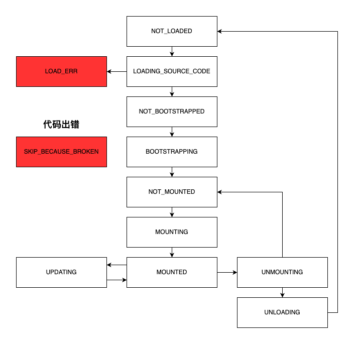

# 微前端

## 什么是微前端
微前端就是通过主应用加载多个不同业务模块的子应用。

## 为什么用微前端
微前端可以解决以下问题
1. 技术栈不同
2. 代码合并部署麻烦
3. 老项目的使用

## 微前端历史
1. `single-spa`实现了路由劫持和应用加载，缺点是`css`和`js`不隔离，不能动态加载`js`
2. `qiankun`基于`single-spa`，解决了`css`和`js`隔离，提供了开箱即用的`API`（`single-spa`，`sandbox`，`import-html-entry`），子应用只需导出`bootstrap`，`mount`，`unmount`方法即可。

## iframe
为什么不使用`iframe`，因为`iframe`中子应用的路由在页面刷新后，会回到初始状态，用户体验不好。

## 通信
1. 基于`url`通信
2. 基于`CustomEvent`通信
3. 基于`props`通信
4. 基于`全局变量`，`Redux`通信

## 公共依赖
1. `CDN`和`externals`
2. `webpack`联邦模块

## css隔离机制
1. `shadowDOM`
2. `BEM`(Block Element Modifier)约定项目前缀
3. `CSS-Modules`打包时生成不冲突的选择器名称
4. `css-in-js`

## 生命周期


### shadowDOM实践
```html
<!DOCTYPE html>
<html lang="en">
<head>
  <meta charset="UTF-8">
  <meta name="viewport" content="width=device-width, initial-scale=1.0">
  <title>Document</title>
  <style>
    span {
      color: pink;
    }
  </style>
</head>
<body>
  <div id="app">
    <!-- 如果mode是closed，显示样式：color: pink -->
    <span>shadowDOM outer</span>
    <div id="shadow-wrapper"></div>
  </div>
  <script>
    const appDOM = document.querySelector('#shadow-wrapper')
    // 初始化shadowDOM
    const shadowDOM = appDOM.attachShadow({
      // 封闭性：'open' | 'closed'
      mode: 'closed'
    })
    const styleTag = document.createElement('style')
    styleTag.innerText = `
      span {
        color: skyblue;
      }
    `
    const spanDOM = document.createElement('span')
    // 如果mode是closed，显示样式：color: blue
    spanDOM.innerText = 'shadowDOM inner'
    shadowDOM.append(spanDOM, styleTag)
    // 如果mode是open，output: #shadow-root (open)
    // 如果mode是closed，output: null
    console.log(appDOM.shadowRoot)
  </script>
</body>
</html>
```

## js隔离机制
1. 利用`window`隔离
2. 利用`proxy`隔离

### window隔离
缺点：
- 污染`window`
- 需要遍历`window`，性能差
- 不支持同时运行多个沙箱

优点：
- 兼容性
```js
class SnapshotSandbox {
  windowSnapshot = {}
  modifyPropsMap = {}

  constructor() {}
  active() {
    for (const key in window) {
      this.windowSnapshot[key] = window[key]
    }
    for (const key in this.modifyPropsMap) {
      window[key] = this.modifyPropsMap[key]
    }
  }
  inactive() {
    for (const key in window) {
      if (window[key] !== this.windowSnapshot[key]) {
        this.modifyPropsMap[key] = window[key]
        window[key] = this.windowSnapshot[key]
      }
    }
  }
}

const sandbox = new SnapshotSandbox()
sandbox.active()
window.foo = 1
// output: 1
console.log(window.foo)
sandbox.inactive()
// output: undefined
console.log(window.foo)
sandbox.active()
// output: 1
console.log(window.foo)
```

### 利用proxy隔离
#### 单例沙箱
缺点：
- 污染`window`
- 不支持同时运行多个沙箱
- 兼容性

优点：
- 不用遍历`window`，性能好
```js
class LegacyProxy {
  // 修改时，备份window上的数据
  modifiedPropsOriginalValueMapInSandbox = {}
  // 新增的数据
  addedPropsMapInSandbox = {}
  // 当前改变的数据
  currentUpdatedPropsValueMap = {}
  // 当前沙箱是否运行中
  sandboxRunning
  // 当前代理的对象
  proxy

  constructor() {
    const fakeWindow = Object.create(null)
    this.proxy = new Proxy(
      fakeWindow,
      {
        get: (target, prop, receiver) => {
          return window[prop]
        },
        set: (target, prop, newVal, receiver) => {
          // 如果当前沙箱停止，返回
          if (!this.sandboxRunning) {
            return true
          }
          // 如果window上没有这个prop，记录在addedPropsMapInSandbox中
          if (!window.hasOwnProperty(prop)) {
            this.addedPropsMapInSandbox[prop] = newVal
            // 如果window上有这个prop，说明这个prop是更改 且 modifiedPropsOriginalValueMapInSandbox没有这个prop
            // 则备份window上的数据到modifiedPropsOriginalValueMapInSandbox中
          } else if (modifiedPropsOriginalValueMapInSandbox.hasOwnProperty(prop)) {
            const originVal = window[prop]
            this.modifiedPropsOriginalValueMapInSandbox[prop] = originVal
          }
          // 记录set的操作
          this.currentUpdatedPropsValueMap[prop] = newVal
          window[prop] = newVal
          return true 
        }
      }
    )
  }

  active() {
    this.sandboxRunning = true
    // 恢复currentUpdatedPropsValueMap至window上
    for (const prop in this.currentUpdatedPropsValueMap) {
      window[prop] = this.currentUpdatedPropsValueMap[prop]
    }
  }

  inactive() {
    this.sandboxRunning = false
    // 恢复window
    // 1. 移除window在addedPropsMapInSandbox记录的prop
    for (const prop in this.addedPropsMapInSandbox) {
      delete window[prop]
    }
    // 2. 恢复window在modifiedPropsOriginalValueMapInSandbox记录的prop
    for (const prop in this.modifiedPropsOriginalValueMapInSandbox) {
      window[prop] = this.modifiedPropsOriginalValueMapInSandbox[prop]
    }
  }
}

const proxyWindow = new LegacyProxy()
proxyWindow.active()
proxyWindow.proxy.foo = 1
// output: 1
console.log(proxyWindow.proxy.foo)
proxyWindow.inactive()
// output: undefined
console.log(proxyWindow.proxy.foo)
proxyWindow.active()
// output: 1
console.log(proxyWindow.proxy.foo)
```

#### 多例沙箱
缺点：
- 兼容性

优点：
- 支持同时运行多个沙箱
- 不污染`window`
- 不用遍历`window`，性能好
```js
class ProxySandbox {
  activeFlag = true
  proxyWindow

  constructor() {
    const fakeWindow = Object.create(null)
    this.proxyWindow = new Proxy(fakeWindow, {
      get: (target, prop, receiver) => {
        if (prop in target) {
          return Reflect.get(target, prop, receiver)
        } else {
          return Reflect.get(window, prop, receiver)
        }
      },
      set: (target, prop, newVal, receiver) => {
        if (!this.activeFlag) {
          return false
        }
        Reflect.set(target, prop, newVal, receiver)
      }
    })
  }
  active() {
    this.activeFlag = true
  }
  inactive() {
    this.activeFlag = false
  }
}

const proxySandbox1 = new ProxySandbox()
const proxySandbox2 = new ProxySandbox()
proxySandbox1.proxyWindow.foo = 'foo1'
proxySandbox2.proxyWindow.foo = 'foo2'
// output: foo1
console.log(proxySandbox1.proxyWindow.foo)
// output: foo2
console.log(proxySandbox2.proxyWindow.foo)
// output: undefined
console.log(window.foo)
proxySandbox1.inactive()
proxySandbox2.inactive()
proxySandbox1.proxyWindow.foo = 'foo1-modify'
// output: foo1
console.log(proxySandbox1.proxyWindow.foo)
// output: foo2
console.log(proxySandbox2.proxyWindow.foo)
// output: undefined
console.log(window.foo)
```
