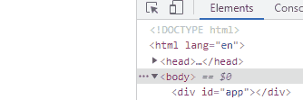
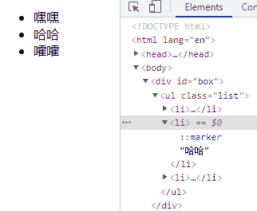
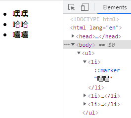
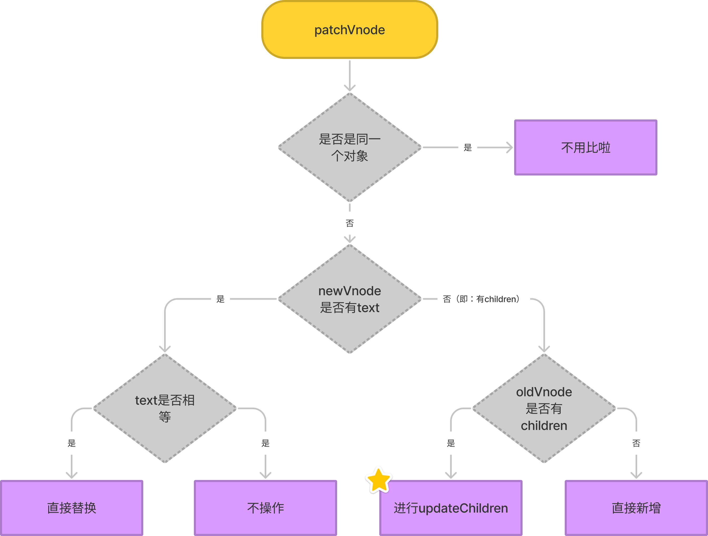
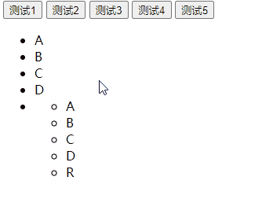

# 【源码系列】Diff算法

> 前言

`Diff算法`和`Virtual DOM`(虚拟DOM)，大家有时候会听到，那它们到底是什么呢，今天就和大家来探究一下。

## 1. Virtual DOM

`Virtual DOM`是什么？它是一个对象，一个将真实DOM抽象，只保留核心属性的对象。

> 那一定有人会有疑问，为什么不用真实DOM，还大费周章搞个Virtual DOM出来？

`Virtual DOM`的优势：

1. 频繁的操作真实DOM会导致大量的回流和重绘，会造成页面卡顿。
2. 利用JS运算成本换取DOM执行成本，因为JS运算速度快很多，搭配`Diff算法`，每次操作时，只计算出渲染为真实DOM最小代价的操作，最后再渲染为真实DOM。
2. 最最最大的优势是提供了跨平台能力（React-native和Weex）。

但是`Virtual DOM`也有一丢丢劣势：

	1. 简易操作时，会比直接操作真实DOM慢。

> 频繁操作真实DOM为什么会卡顿，其实不光是回流和重绘，稍微跑题一下

我们要知道：

1. JS引擎和DOM引擎相互独立，但又工作在同一个线程里（主线程）。
2. JS调用DOM操作时必须挂起JS引擎、转换传入数据、激活DOM引擎，DOM重绘后再转换时可能还有返回值，最后激活JS引擎并继续执行。假如有频繁的DOM API调用，且浏览器厂商不做“批量处理优化”，引擎间的切换的单位代价会迅速积累。若有强制重绘的DOM API调用，浏览器回流和重绘会引起更大的性能消耗。

## 2. snabbdom

> 为什么又出来一个`snabbdom`，这又是个啥？

`snabbdom`是`Virtual DOM`的始祖。而且它的源码清晰明了，我们可以通过它来理解Vue的`Virtual DOM`。

### 1. 简单使用snabbdom

首先我们构建一个项目，然后进行安装，我这边使用的构建工具是`Vite`。

终端运行命令：

`yarn create vite`

`yarn add snabbdom`

初始好项目后，让我们写代码吧。

```js
/* 小试牛刀.js */

// 导入snabbdom
import { h, init, thunk } from 'snabbdom'

// init()返回一个patch函数，用来比较两个虚拟DOM的差异，然后更新到真实的DOM里
// 如果第一个参数是真实DOM，则会将它转化为Virtual DOM
// 这边暂时传一个空数组[]
const patch = init([])

// h方法有很多传参方式，这边使用这一种
// @param sel 选择器
// @param data 数据
// @param children String | Virtual Dom | Virtual Dom数组
// @returns VNode
const vNode = h('div#box', {}, [
  h('ul.list', {}, [
    h('li', {}, '嘿嘿'),
    h('li', {}, '哈哈'),
    h('li', {}, '嚯嚯')
  ])
])

const app = document.querySelector('#app')


setTimeout(() => {
  patch(app, vNode)
}, 1000)

setTimeout(() => {
  const newVNode = h('div#box', {}, [
    h('ul.list', {}, [
      h('li', {}, '嘿嘿'),
      h('li', {}, '哈哈，真开心'),
      h('li', {}, '嚯嚯')
    ])
  ])
  patch(vNode, newVNode)
}, 2000)
```

运行项目，让我们看看效果吧~



我们发现`Vitrual DOM`生成的真实DOM把#app替换了；



1s后两个`Virtual DOM`之间开始比较差异，第二个li发生了改变。

### 2. Virtual DOM的例子

说了那么久，也不知道Virtual DOM到底长啥样，现在就一起看看吧。

> 真实DOM

```html
<div id="box">
  <ul class="list">
    <li>嘿嘿</li>
    <li>哈哈</li>
    <li>嚯嚯</li>
  </ul>
</div>
```

> Virtual DOM

```js
{
  // 选择器
  "sel": "div#box",
  "data": {},
  "children": [
    {
      "sel": "ul.list",
      "data": {},
      "children": [
        {
          "sel": "li",
          "data": {},
          "text": "嘿嘿",
          "elm": {}
        },
        {
          "sel": "li",
          "data": {},
          "text": "哈哈",
          "elm": {}
        },
        {
          "sel": "li",
          "data": {},
          "text": "嚯嚯",
          "elm": {}
        }
      ],
      "elm": {}
    }
  ],  
  // 真实DOM
  "elm": {}
}
```

原来`Virtual DOM`是这个样子。

## 3. 手写源码

犹豫不决，直接手写源码吧~

我们知道，通过`h`函数可以创建`Virtual DOM`，我们先看看别人源码是怎么写的。

> 注：为了方便理解，源码已经过删减，只展示核心代码。

```typescript
/* h.ts */

/**
 * @param  {string} sel                     选择器
 * @param  {VNodeData|null} data            数据
 * @param  {VNodeChildren|string|Vnode} children  Vnode数组|text|Vnode
 * @returns VNode                           返回Vnode
 */
// 这边使用了方法重载，为了方便观察，这边直接只看这个这一种情况
export function h(sel: any, b?: any, c?: any): VNode {
  let data: VNodeData = {};
  let children: any;
  let text: any;
  data = b;
  // 如果是数组
  if (is.array(c)) {
    children = c;
  } 
  // 如果是text
  else if (is.primitive(c)) {
    text = c.toString();
  } 
  // 如果是Vnode，处理成数组
  // 通过有没有sel属性进行判断c是不是Vnode
  else if (c && c.sel) {
    children = [c];
  }
  return vnode(sel, data, children, text, undefined);
}
```

我们发现在最后返回了一个`vnode`函数的返回值。让我们找到`vnode`函数。

```typescript
/* vnode.ts */

/**
 * @param  {string|undefined} sel                         选择器
 * @param  {any|undefined} data                           数据
 * @param  {Array<VNode|string>|undefined} children       包含Vnode或者文本的children数组
 * @param  {string|undefined} text                        文本  
 * @param  {Element|DocumentFragment|Text|undefined} elm  真实DOM
 * @returns data                                          返回一个对象
 */
export function vnode(
  sel: string | undefined,
  data: any | undefined,
  children: Array<VNode | string> | undefined,
  text: string | undefined,
  elm: Element | DocumentFragment | Text | undefined
): VNode {
  // 这边将key从data中提取，直接赋值到返回的对象上。
  const key = data === undefined ? undefined : data.key;
  return { sel, data, children, text, elm, key };
}
```

原来就是提取下key，然后将形参返回回来。

生成`Vnode`就是这么简单。

好记性不如烂笔头，现在让我们手写一个`h`函数试试看。

```js
/* h.js */
import vnode from './vnode'

export default function (a, b, c) {
  let children
  let text
  if (typeof c === 'string' || typeof c === 'number') {
    text = c.toString()
  }
  if (c && c.sel) {
    children = [c]
  }
  else if (Array.isArray(c)) {
    children = c
  }
  return vnode(a, b, children, text, undefined)
}

/* vnode.js */
export default function (sel, data, children, text, elm) {
  const key = data?.key
  return { sel, data, children, text, elm, key }
}
```

很快就写好啦，写个代码测测看能不能用。

```js
/* main.js */

/* 测试h函数 */
import h from './js/h'

const vnode = h('ul', { key: 'ul1' }, [
  h('li', { key: 'li1' }, '嘿嘿'),
  h('li', { key: 'li2' }, '哈哈'),
  h('li', { key: 'li3' }, '嘻嘻')
])

console.log('vnode', vnode)
// {
//   "sel": "ul",
//   "data": {
//       "key": "ul1"
//   },
//   "children": [
//       {
//           "sel": "li",
//           "data": {
//               "key": "li1"
//           },
//           "text": "嘿嘿",
//           "elm": {},
//           "key": "li1"
//       },
//       // ...
//   ],
//   "elm": {},
//   "key": "ul1"
// }
```

运行结果和预想的一模一样。

ok，我们已经解决`h`函数了，接下来研究`patch`函数。老样子先看源代码。

因为`patch`函数是通过`init`函数生成的，所以我进入`init.ts`看源码。

首先看下几个`patch`函数中用到的函数：

```typescript
/* init.ts */

/**
  * 将node转为vnode
  * @param  {Element} elm  node
  * @returns VNode         vnode
  */
function emptyNodeAt(elm: Element) {
  return vnode(
    api.tagName(elm).toLowerCase(),
    {},
    [],
    undefined,
    elm
  );
}

/**
 * 通过sel和key来判断是否是相似的vnode
 * @param  {VNode} vnode1
 * @param  {VNode} vnode2
 * @returns boolean
 */
function sameVnode(vnode1: VNode, vnode2: VNode): boolean {
  const isSameKey = vnode1.key === vnode2.key;
  const isSameSel = vnode1.sel === vnode2.sel;

  return isSameSel && isSameKey;
}

/**
  * @param  {VNode} vnode
  * @returns Node
  */
function createElm(vnode: VNode): Node {
  // 创建node
  const elm = vnode.elm = api.createElement(vnode.sel);
  // 如果有children，递归append到node
  if (is.array(vnode.children)) {
    for (let i = 0; i < vnode.children.length; ++i) {
      const ch = vnode.children[i];
      if (ch != null) {
        api.appendChild(elm, createElm(ch as VNode));
      }
    }
  } 
  // 如果有text，创建textNode后append到node
  else if (is.primitive(vnode.text)) {
    api.appendChild(elm, api.createTextNode(vnode.text));
  }
  return vnode.elm;
}
```

准备好了吗，我们看下`patch`函数到底做了什么事情吧。

```typescript
/* init.ts */

/**
  * @param  {VNode|Element} oldVnode  旧vnode
  * @param  {VNode} vnode             新vnode
  * @returns VNode                    返回vnode
  */
return function patch(
  oldVnode: VNode | Element,
  vnode: VNode
): VNode {
  // 如果oldVnode是DOM
  if (isElement(api, oldVnode)) {
    // 创建vnode，并赋值给oldVnode
    oldVnode = emptyNodeAt(oldVnode);
  } 
  // 是同一个vnode
  if (sameVnode(oldVnode, vnode)) {
    // 深入比较
    patchVnode(oldVnode, vnode);
  } 
  // 不是同一个vnode
  // 直接替换
  else {
    const elm = oldVnode.elm!;
    // 获取node的parentNode
    const parent = api.parentNode(elm) as Node;
    // 创建node，这边内部会递归调用，生成完整的node
    createElm(vnode);
    // 插入到parentNode
    api.insertBefore(parent, vnode.elm!, api.nextSibling(elm));
    // 删除oldVnode.elm，相当于parent.removeChild(oldVnode.elm)
    removeVnodes(parent, [oldVnode], 0, 0);
  }
  return vnode;
};
```

如果不考虑是同一个`vnode`的话，还是挺简单的。那就先不考虑这种情况，开始手写吧。

```js
/* emptyNodeAt.js */ 

import vnode from './vnode'

export default function (node) {
  return vnode(node.tagName, undefined, undefined, undefined, node)
}

/* isSameVnode.js */

export default function (oldVnode, newVnode) {
  return oldVnode.key === newVnode.key && oldVnode.sel === newVnode.sel
}

/* createElm.js */

export default function createElm(vnode) {
  const node = vnode.elm = document.createElement(vnode.sel)
  if (vnode.text) {
    node.innerText = vnode.text
  }
  else if (vnode.children) {
    for (const child of vnode.children) {
      const childNode = createElm(child)
      node.append(childNode)
    }
  }
  return node
}

/* patch.js */

import emptyNodeAt from './emptyNodeAt'
import isSameVnode from './isSameVnode'
import createElm from './createElm'
import patchVnode from './patchVnode'

export default function (oldVnode, newVnode) {
  if (!oldVnode.sel) {
    oldVnode = emptyNodeAt(oldVnode)
  }
  if (isSameVnode(oldVnode, newVnode)) {
    patchVnode(oldVnode, newVnode)
  }
  else {
    const newNode = createElm(newVnode)
    oldVnode.elm.parentNode.insertBefore(newNode, oldVnode.elm)
  }
  return newVnode
}

```

好像也不是很难，让我们测试一下吧。

```js
/* main.js */

/* 测试patch函数 */
import h from './js/h'
import patch from './js/patch'

const node = document.querySelector('#app')

const vnode = h('ul', { key: 'ul1' }, [
  h('li', { key: 'li1' }, '嘿嘿'),
  h('li', { key: 'li2' }, '哈哈'),
  h('li', { key: 'li3' }, '嘻嘻')
])

patch(node, vnode)
```



好耶，成功了。

让我们看看，如果是同一个`vnode`怎么处理呢。

先看流程图。



好看懂了吗，让我们看看源码吧。

```typescript
/* init.ts */

/**
  * @param  {VNode} oldVnode
  * @param  {VNode} vnode
  */
function patchVnode(
  oldVnode: VNode,
  vnode: VNode,
) {
  // 将oldVnode.elm赋值到vnode.elm
  const elm = (vnode.elm = oldVnode.elm)!;
  const oldCh = oldVnode.children as VNode[];
  const ch = vnode.children as VNode[];
  // 如果是同一个对象，就不用比啦
  if (oldVnode === vnode) return;
  // 以下分为4种情况（源码考虑到text和children不存在的情况，有6种，我们只考虑存在4种）
  // 1. newvnode没有text，即有children
  if (isUndef(vnode.text)) {
    // 1.1. 都有children，情况最复杂，之后讨论
    if (isDef(oldCh)) {
      if (oldCh !== ch) updateChildren(elm, oldCh, ch);
    } 
    // 1.2. oldVnode没有children，直接新增
    else {
      if (isDef(oldVnode.text)) api.setTextContent(elm, "");
      // 新增vnodes
      addVnodes(elm, null, ch, 0, ch.length - 1);
    } 
  } 
  // 2.   newVnode有text
  // 2.1. text不一样，或者oldVonde的text为空，直接替换
  // 2.2. text一样，不操作
  if (oldVnode.text !== vnode.text) {
    // 置空oldVnode的children
    if (isDef(oldCh)) {
      removeVnodes(elm, oldCh, 0, oldCh.length - 1);
    }
    api.setTextContent(elm, vnode.text!);
  }
}
```

按照惯例，继续手写。

```js
/* patchVnode.js */

import createElm from './createElm'
import updateChildren from './updateChildren'

export default function (oldVnode, newVnode) {
  newVnode.elm = oldVnode.elm
  if (oldVnode === newVnode) return 
  if (newVnode.text) {
    if (oldVnode.text !== newVnode.text) {
      oldVnode.elm.innerText = newVnode.text
    }
  }
  else {
    if (oldVnode.children) {
      updateChildren(oldVnode.elm, oldVnode.children, newVnode.children)
    }
    else {
      oldVnode.elm.innerHTML = ''
      for (const child of newVnode.children) {
        const childNode = createElm(child)
        oldVnode.elm.append(childNode)
      }
    }
  }
}

```

然后测试。

```js
/* main.js */

/* 测试patchVnode函数 */

import h from './js/h'
import patch from './js/patch'

const node = document.querySelector('#app')

const vnode = h('ul', { key: 'ul1' }, [
  h('li', { key: 'li1' }, '嘿嘿'),
  h('li', { key: 'li2' }, '哈哈'),
  h('li', { key: 'li3' }, '嘻嘻')
])

// 测试text
const vnode2 = h('ul', { key: 'ul1' }, '666')

// 测试children
const vnode3 = h('ul', { key: 'ul1' }, [
  h('li', { key: 'li1' }, '嘿嘿'),
])

patch(node, vnode)

setTimeout(() => {
  patch(vnode, vnode2)
}, 1000)

setTimeout(() => {
  patch(vnode2, vnode3)
}, 2000)

```


没有问题。

最终BOSS来了，让我们看看`updateChildren`函数。

```typescript
/* init.ts */

/**
  * @param  {Node} parentElm
  * @param  {VNode[]} oldCh
  * @param  {VNode[]} newCh
  */
function updateChildren(
  parentElm: Node,
  oldCh: VNode[],
  newCh: VNode[]
) {
  // oldStartIdx  旧开始索引，下面简称os
  // oldEndIdx    旧结束索引，下面简称oe
  // newStartIdx  新开始索引，下面简称ns
  // newEndIdx    新结束索引，下面简称ne
  let oldStartIdx = 0;
  let newStartIdx = 0;
  let oldEndIdx = oldCh.length - 1;
  let oldStartVnode = oldCh[0];
  let oldEndVnode = oldCh[oldEndIdx];
  let newEndIdx = newCh.length - 1;
  let newStartVnode = newCh[0];
  let newEndVnode = newCh[newEndIdx];
  let before: any;

  // 当指针交错时停止
  // 我们发现整个while作用域都是if、else if和else，说明当进入某个if、else if和else作用域，执行里面的代码后，直接进入下次循环。
  while (oldStartIdx <= oldEndIdx && newStartIdx <= newEndIdx) {
    // vnode为空，移动指针，进入下次循环
    if (oldStartVnode == null) {
      oldStartVnode = oldCh[++oldStartIdx]; // Vnode might have been moved left
    } else if (oldEndVnode == null) {
      oldEndVnode = oldCh[--oldEndIdx];
    } else if (newStartVnode == null) {
      newStartVnode = newCh[++newStartIdx];
    } else if (newEndVnode == null) {
      newEndVnode = newCh[--newEndIdx];
    }
    // 开始比较
    // 1. os ns 命中后patchVnode，os++，ns++
    else if (sameVnode(oldStartVnode, newStartVnode)) {
      patchVnode(oldStartVnode, newStartVnode);
      oldStartVnode = oldCh[++oldStartIdx];
      newStartVnode = newCh[++newStartIdx];
    } 
    // 2. oe ne 命中后patchVnode，oe--，ne--
    else if (sameVnode(oldEndVnode, newEndVnode)) {
      patchVnode(oldEndVnode, newEndVnode);
      oldEndVnode = oldCh[--oldEndIdx];
      newEndVnode = newCh[--newEndIdx];
    } 
    // 3. os ne 命中后patchVnode，然后将真实DOM后移，os++，ne--
    else if (sameVnode(oldStartVnode, newEndVnode)) {
      // Vnode moved right
      patchVnode(oldStartVnode, newEndVnode);
      // insertBefore是Node.insertBefore的二次封装函数
      // 这里将os对应的节点移到了oe节点的后面
      api.insertBefore(
        parentElm,
        oldStartVnode.elm!,
        // nextSibling是Node.nextSibling的二次封装
        api.nextSibling(oldEndVnode.elm!)
      );
      oldStartVnode = oldCh[++oldStartIdx];
      newEndVnode = newCh[--newEndIdx];
    } 
    // 4. oe ns 命中后patchVnode，然后将真实DOM前移，oe--，ns++
    else if (sameVnode(oldEndVnode, newStartVnode)) {
      // Vnode moved left
      patchVnode(oldEndVnode, newStartVnode);
      // 这里将oe对应的节点移到了os节点的前面
      api.insertBefore(parentElm, oldEndVnode.elm!, oldStartVnode.elm!);
      oldEndVnode = oldCh[--oldEndIdx];
      newStartVnode = newCh[++newStartIdx];
    }
    // 5. 真不巧，上述4种情况都没命中，看看下面怎么处理的。
    else {
      // oldKeyToIdx  存放oldVnode.children所有的key
      // idxInOld     找到的key
      // elmToMove    
      // before
      let oldKeyToIdx: KeyToIndexMap | undefined;
      let idxInOld: number;
      let elmToMove: VNode;
      // 这里将oldKey都存储到oldKeyToIdx里
      // oldKeyToIdx里的元素结构是{ [key: string]: number }
      if (oldKeyToIdx === undefined) {
        oldKeyToIdx = createKeyToOldIdx(oldCh, oldStartIdx, oldEndIdx);
      }
      // ns的key是否能在oldKeyToIdx找到
      idxInOld = oldKeyToIdx[newStartVnode.key as string];
      // 找不到，直接新增
      if (isUndef(idxInOld)) {
        // New element
        api.insertBefore(
          parentElm,
          createElm(newStartVnode),
          oldStartVnode.elm!
        );
      } 
      // 找到了
      else {
        // 获取到对应DOM
        elmToMove = oldCh[idxInOld];
        // 如果标签不一致，那对不起，不是同一个节点，直接新增
        if (elmToMove.sel !== newStartVnode.sel) {
          api.insertBefore(
            parentElm,
            createElm(newStartVnode),
            oldStartVnode.elm!
          );
        } 
        // 标签一致，恭喜，执行patchVnode，然后将oldCh[idxInOld]置为undefined，DOM插入到os的DOM的前面
        else {
          patchVnode(elmToMove, newStartVnode);
          oldCh[idxInOld] = undefined as any;
          api.insertBefore(parentElm, elmToMove.elm!, oldStartVnode.elm!);
        }
      }
      // 最后将ns++
      newStartVnode = newCh[++newStartIdx];
    }
  }
  // 终于跳出循环了，感觉轻松了不少。
  // 怎么下面还有代码？晕。。。
  // 没事继续看看还有啥。

  // 假设os > oe这时跳出循环，但是ns和ne之间的vnode还没加入到parentElm里。所以：
  // 如果ns小于ne，也就是ns和ne之间还有待加入的vnode
  if (newStartIdx <= newEndIdx) {
    before = newCh[newEndIdx + 1] == null ? null : newCh[newEndIdx + 1].elm;
    // 循环插入
    addVnodes(
      parentElm,
      before,
      newCh,
      newStartIdx,
      newEndIdx
    );
  }
  // 同上这边也要删除
  // 如果os小于oe，也就是ns和ne之间还有待删除的vnode
  if (oldStartIdx <= oldEndIdx) {
    // 循环删除
    removeVnodes(parentElm, oldCh, oldStartIdx, oldEndIdx);
  }
}
```

是不是很烧脑，我也觉得。如果觉得不太懂，可以搜搜相关的视频教程。不过我看视频也没看懂，sad。但是我看了几遍源码后就突然顿悟了，希望你也如此。

废话不多说，直接手写。

```js
/* updateChildren.js */

import createElm from "./createElm"
import isSameVnode from "./isSameVnode"
import patchVnode from "./patchVnode"

export default function (parentElm, oldCh, newCh) {
  let os = 0
  let oe = oldCh.length - 1
  let ns = 0
  let ne = newCh.length - 1

  while (os <= oe && ns <= ne) {
    if (!oldCh[os]) {
      os++
    }
    else if (!oldCh[oe]) {
      oe--
    }
    else if (!newCh[ns]) {
      ns++
    }
    else if (!newCh[ne]) {
      ne--
    }
    else if (isSameVnode(oldCh[os], newCh[ns])) {
      patchVnode(oldCh[os], newCh[ns])
      os++
      ns++
    }
    else if (isSameVnode(oldCh[oe], newCh[ne])) {
      patchVnode(oldCh[oe], newCh[ne])
      oe--
      ne--
    }
    else if (isSameVnode(oldCh[os], newCh[ne])) {
      parentElm.insertBefore(oldCh[os].elm, oldCh[oe].elm.nextSibling)
      patchVnode(oldCh[os], newCh[ne])
      os++
      ne--
    }
    else if (isSameVnode(oldCh[oe], newCh[ns])) {
      parentElm.insertBefore(oldCh[oe].elm, oldCh[os].elm)
      patchVnode(oldCh[oe], newCh[ns])
      oe--
      ns++
    }
    else {
      const oldKeys = {} 
      oldCh.forEach((ch, i) => {
        if (ch) {
          oldKeys[ch.key] = i 
        }
      })
      const i = oldKeys[newCh[ns].key]
      if (i === undefined) {
        parentElm.insertBefore(createElm(newCh[ns]), oldCh[os].elm)
      }
      else {
        if (oldCh[i].sel === newCh[ns].sel) {
          patchVnode(oldCh[i], newCh[ns])
          parentElm.insertBefore(oldCh[i].elm, oldCh[os].elm)
          oldCh[i] = undefined
        }
        else {
          parentElm.insertBefore(createElm(newCh[ns]), oldCh[os].elm)
        }
      }
      ns++
    }
  }

  if (ns <= ne) {
    const before = newCh[ne + 1] ? newCh[ne + 1].elm : null
    for (; ns <= ne; ns++) {
      parentElm.insertBefore(createElm(newCh[ns]), before)
    }
  }
  if (os <= oe) {
    for (; os <= oe; os++) {
      if (oldCh[os]) {
        parentElm.removeChild(oldCh[os].elm)
      }
    }
  }
}
```

写完啦。让我们测试一下吧。

```js
/* main.js */

/* 全流程测试 */

import h from './js/h'
import patch from './js/patch'

const node = document.querySelector('#app')

const vnode = h('ul', {}, [
  h('li', { key: 'A' }, 'A'),
  h('li', { key: 'B' }, 'B'),
  h('li', { key: 'C' }, 'C'),
  h('li', { key: 'D' }, 'D'),
  h('li', { key: 'E' }, 'E'),
])

const vnode2 = h('ul', {}, [
  h('li', { key: 'E' }, 'E'),
  h('li', { key: 'D' }, 'D'),
  h('li', { key: 'C' }, 'C'),
  h('li', { key: 'B' }, 'B'),
  h('li', { key: 'A' }, 'A'),
])

const vnode3 = h('ul', {}, [
  h('li', { key: 'E' }, 'E'),
  h('li', { key: 'D' }, 'D'),
  h('li', { key: 'C' }, 'C'),
  h('li', { key: 'A' }, 'A'),
  h('li', { key: 'B' }, 'B'),
  h('li', { key: 'K' }, 'K'),
])

const vnode4 = h('ul', {}, [
  h('li', { key: 'A' }, 'A'),
  h('li', { key: 'B' }, 'B'),
  h('li', { key: 'C' }, 'C'),
])

const vnode5 = h('ul', {}, [
  h('li', { key: 'E' }, 'E'),
  h('li', { key: 'C' }, 'C'),
  h('li', { key: 'V' }, 'V'),
])

const vnode6 = h('ul', {}, [
  h('li', { key: 'A' }, 'A'),
  h('li', { key: 'B' }, 'B'),
  h('li', { key: 'C' }, 'C'),
  h('li', { key: 'D' }, 'D'),
  h(
    'li',
    { key: 'E' },
    h('ul', {}, [
      h('li', { key: 'A' }, 'A'),
      h('li', { key: 'B' }, 'B'),
      h('li', { key: 'C' }, 'C'),
      h('li', { key: 'D' }, 'D'),
      h('li', { key: 'E' }, h('div', { key: 'R' }, 'R')),
    ])
  ),
])

let oldVnode
oldVnode = patch(node, vnode)

const vnodeList = [vnode2, vnode3, vnode4, vnode5, vnode6]
const btn = document.querySelectorAll('.btn')
for (let i = 0; i < btn.length; i++) {
  btn[i].onclick = () => {
    oldVnode = patch(oldVnode, vnodeList[i])
  }
}
```



好耶！成功啦~（当然不是一次成功的啦2333）

## 4. 结语

`Diff算法`好难，不过多看看还是可以理解的。文章写的时间不长，而且作者也很粗心，如有错误，请指点，谢谢~

> 参考文章：
>
> 1. https://juejin.cn/post/6994959998283907102
> 2. https://juejin.cn/post/6990582632270528525
> 3. https://github.com/mqyqingfeng/frontend-interview-question-and-answer/issues/3
> 3. https://cloud.tencent.com/developer/article/1458958