### 1. AIGC
`AIGC`（AI Generated Content）是AI生成的内容。

### 2. 生成式AI
生成式AI（generative AI）所生成的内容即为`AIGC`。

### 3. 技术架构
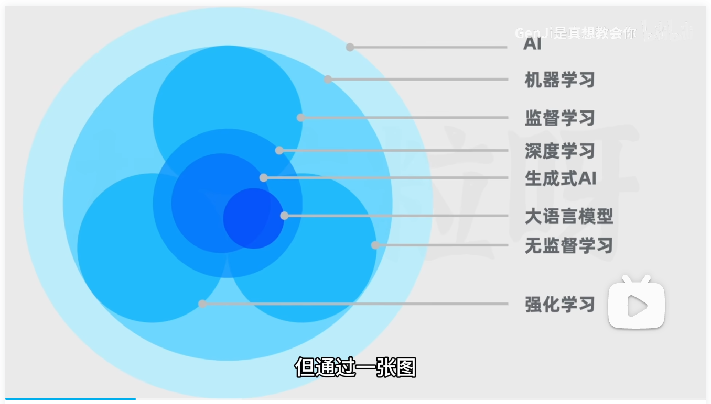
1. AI：计算机模拟人类的智能
2. 机器学习：不通过编程，而是通过代码自己学习来实现决策
- 监督学习：给出多个带有正确输出值的输入值。最终模型能在给出新的输入值时得到正确输出值。监督学习分为：
  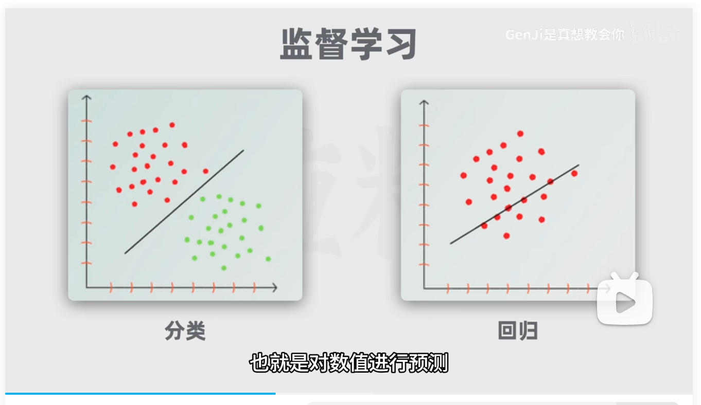
  - 分类：把数据划分不同类别。例如区分猫狗
  - 回归：对数值进行预测。例如预测房价
- 非监督学习：给出的只有输入值。最终模型能自主发现模式或规律，将相似的输入值分组
  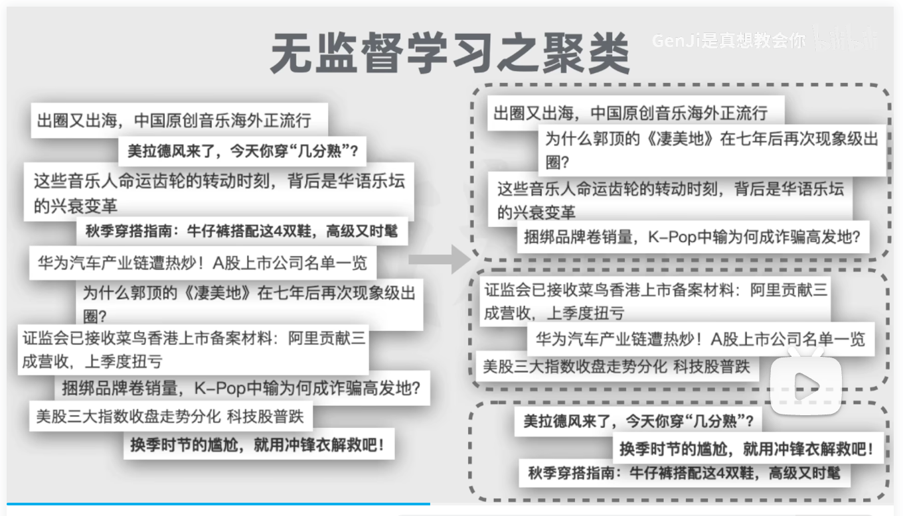
  - 聚类：将相似的输入值分组。例如文章分类
- 强化学习：模型在行动后，通过反馈来学习。
  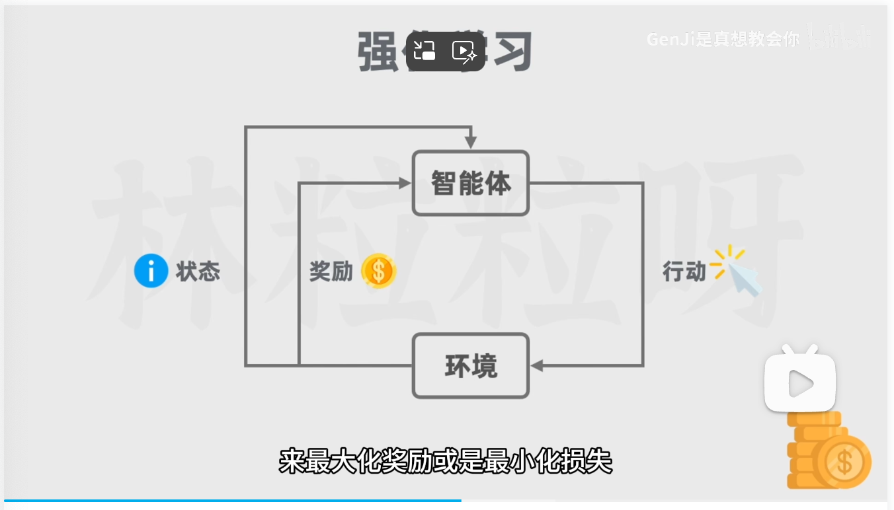
3. 深度学习：使用神经网络模拟人脑处理信息的方式，由多个神经元组成。分为输入层、隐藏层、输出层。输入层主要是获取信息，隐藏层主要是处理信息获取特征，输出层主要是输出信息。
  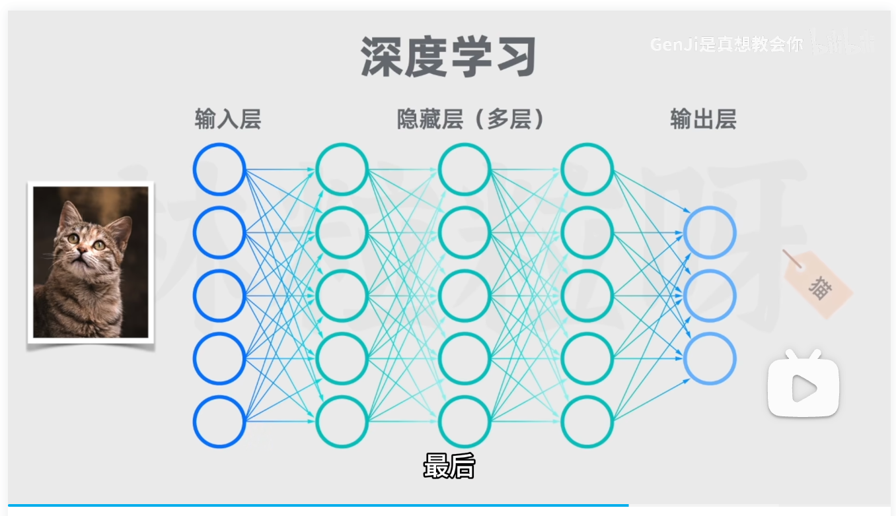
4. 生成式AI：是深度学习的一种应用。利用神经网络识别现有内容，生成新的内容。
5. 大语言模型（Large Language Models）：是深度学习的一种应用。用于处理自然语言数据。
  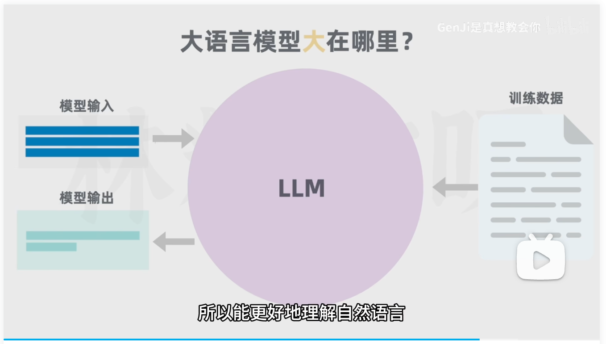

### 4. 生成式AI和大语言模型
两者**互不包含**
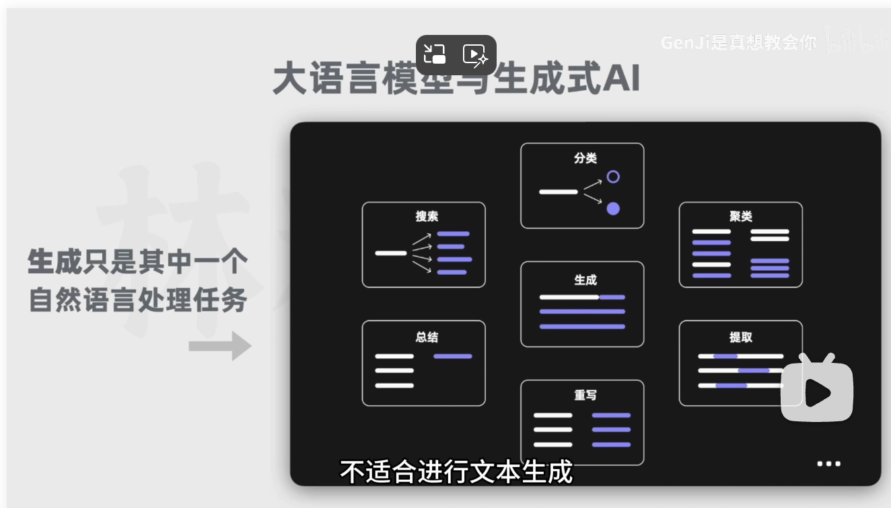

### 5. 大语言模型
大语言模型是做**自然语言处理**的模型。具体任务可以是**生成**、**分类**、**总结**、**改写**等。
如何理解大语言模型的大？**训练数据量大**和**参数数量大**。可以执行的任务比单个小模型多。

### 6. Attention Is All You Need
谷歌发布了一篇`Attention Is All You Need`的文章。里面提到了`Transformer`架构，这改变了自然语言处理的方式。

### 7. RNN
在`Transformer`诞生之前，自然语言采用的是循环神经网络`RNN`（Recurrent Neural Network）。
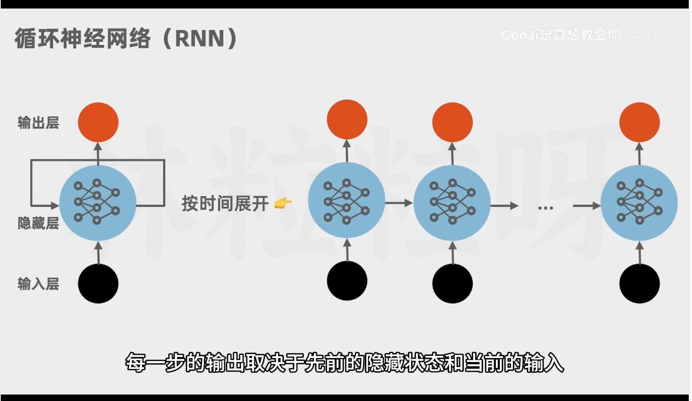
缺点：
- 需要上一步骤的隐藏状态，无法并行执行。
- 难以捕获长距离的语义关系

### 8. Transformer
`Transformer`利用了**自注意力机制**和**位置编码**，解决了上述缺点。
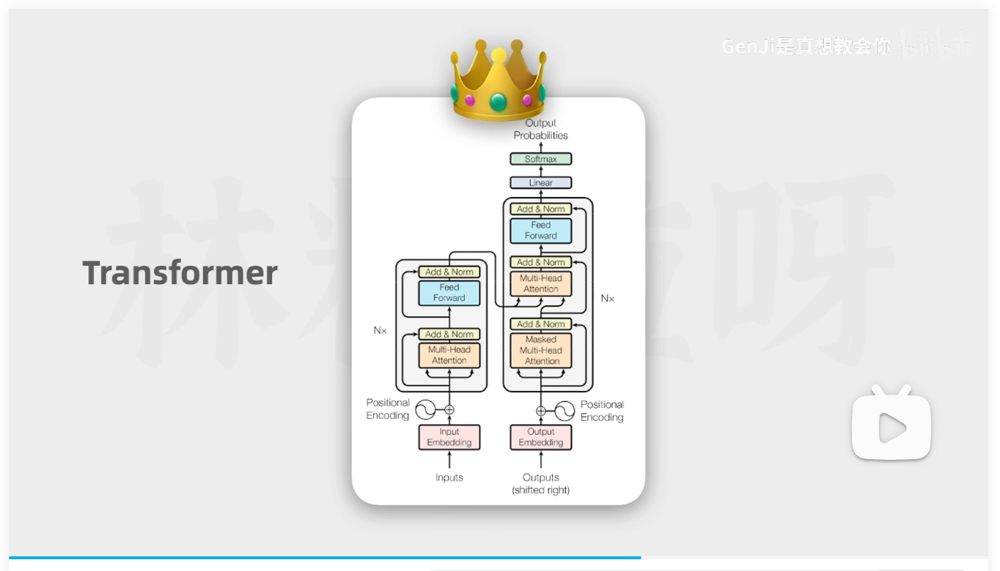

### 9.自注意力机制
获取当前词关联的其它词的自注意力权重，匹配更合适的词。
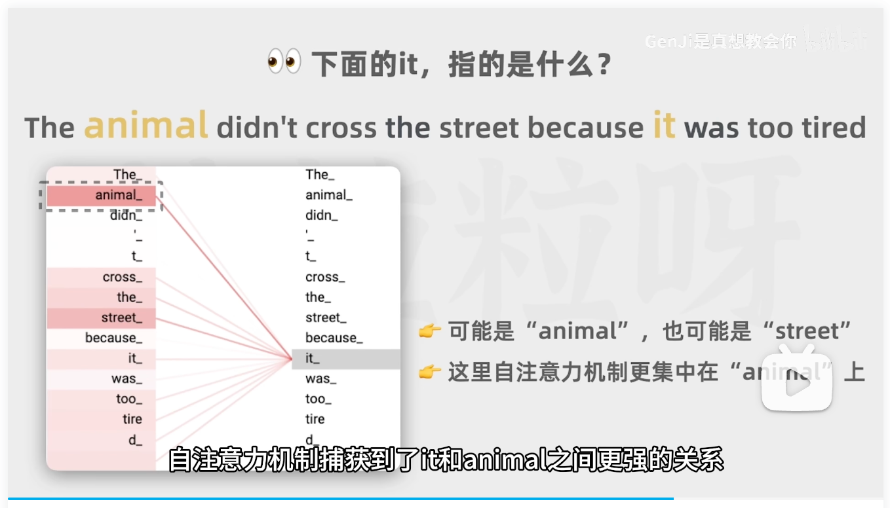

### 10.位置编码
将位置向量和词向量合并，交给神经网络。实现并行执行。
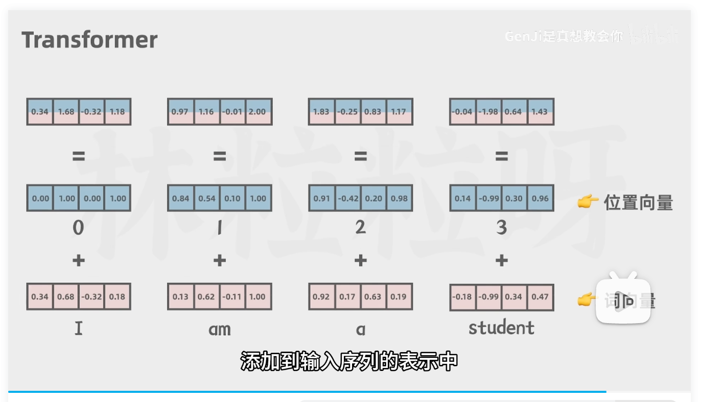

### 11. GPT实现原理
通过预测语句下一个生成的词，类似于谷歌搜索。

### 12. Transformer实现原理
`Transformer`包含一个编码器和一个解码器。
执行顺序：
1. token化
2. 通过嵌入编码获取词向量
3. 通过位置编码获取位置向量
4. 通过多头自注意力机制获取当前词关联的其它词的自注意力权重
5. 通过前馈神经网络增强表达能力
6. 将结果传入解码器
7. 将`Transformer`生成的结果传给解码器
8. 通过掩码多头自注意力机制获取当前词关联的其它词的自注意力权重
9. 将结果和编码器的结果再次通过多头自注意力机制获取当前词关联的其它词的自注意力权重
10. 通过前馈神经网络增强表达能力
11. 通过`leaner`和`softmax`获取关联词概率的概率分布

### 13. gpt实现原理
1. 通过大量的文本数据训练出基座模型
2. 通过监督微调，喂对话数据给模型，训练模型
3. 训练一个奖励模型
4. 微调基座模型通过奖励模型强化学习
