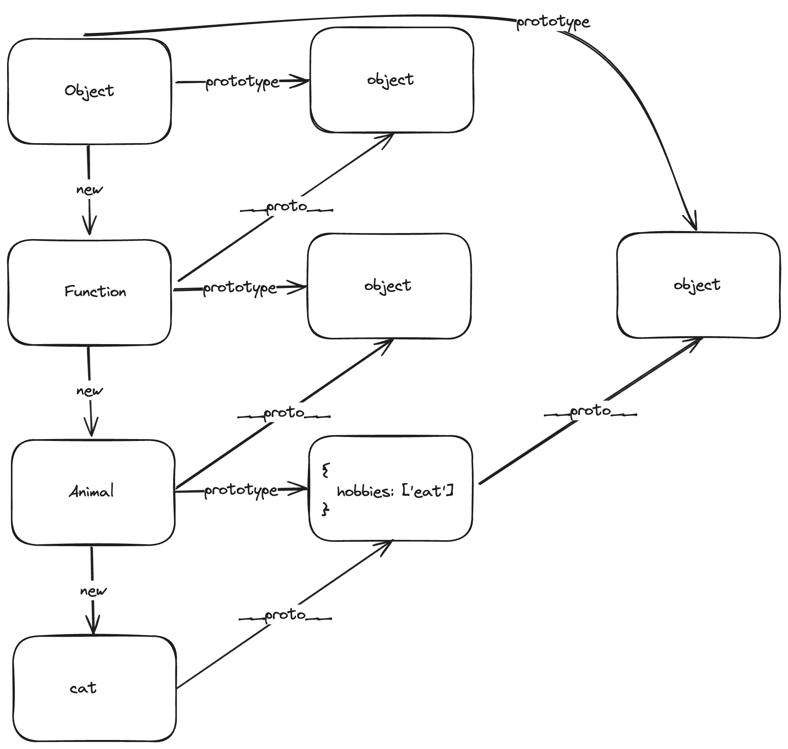

# class
## 原型
```js
function Animal(name) {
  this.name = name
  // 属性分为两种：实例属性、公共属性
  // 实例属性
  this.skills = ['sleep']
}
// 公共属性
Animal.prototype.hobbies = ['eat']
const cat = new Animal('cat')
const pig = new Animal('pig')
// output: Animal { name: 'cat', skills: [ 'sleep' ] }
console.log(cat)
// output: Animal { name: 'pig', skills: [ 'sleep' ] }
console.log(pig)
// output: false
console.log(cat.skills === pig.skills)
// output: true
console.log(cat.hobbies === pig.hobbies)
// output: { hobbies: [ 'eat' ] }
console.log(Animal.prototype)
// output: true
console.log(cat.__proto__ === Animal.prototype)
// output: true
console.log(cat.__proto__.__proto__ === Object.prototype)
// output: true
console.log(Animal.__proto__ === Function.prototype)
```


## 继承
```js
function Animal(name) {
  this.name = name
  this.skills = ['sleep']
}
Animal.prototype.hobbies = ['eat']
function Cat(name) {
  this.name = name
  // 获取实例属性
  Animal.apply(this, arguments)
}
// 1. Object.setPrototypeOf
Object.setPrototypeOf(Cat.prototype, Animal.prototype)
// 2. 直接将Animal.prototype赋值到Cat.prototype.__proto__上
// Cat.prototype.__proto__ = Animal.prototype
// 3. Object.create
// Cat.prototype = Object.create(
//   Animal.prototype,
//   {
//     constructor: {
//       value: Cat
//     }
//   }
// )
// 4. 手写create
// function create(previousClass, currentClass) {
//   function Fn() {}
//   Fn.prototype = previousClass.prototype
//   const fn = new Fn()
//   fn.constructor = currentClass
//   return fn
// }
// Cat.prototype = create(Animal, Cat)
Cat.prototype.cuteFlag = true
const cat = new Cat('orange')
// output: Cat { name: 'orange', skills: [ 'sleep' ] }
console.log(cat)
// output: [ 'eat' ]
console.log(cat.hobbies)
// output: true
console.log(cat.cuteFlag)
// output: [Function: Cat]
console.log(cat.constructor)
```
