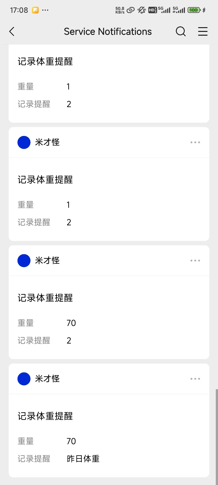

# 小程序订阅功能

## 流程
1. 申请小程序订阅消息功能
2. 申请小程序订阅消息模板，生成`template_id`
3. 后端根据`APPID`和`APPSECRET`生成`ACCESS_TOKEN`
4. 前端获取当前用户的`js_code`传给后端
5. 前端弹窗提示当前用户`授权消息订阅`功能
6. 后端根据`APPID`、`APPSECRET`和`js_code`生成当前用户的`openid`
7. 后端通过`touser(openid)`、`ACCESS_TOKEN`、`template_id`和`data（消息配置信息）`发送订阅消息
8. 用户收到信息

## 相关接口
1. [小程序公众平台-功能-订阅消息（需要手动跳转）](https://mp.weixin.qq.com/)
2. [生成`ACCESS_TOKEN`](https://developers.weixin.qq.com/miniprogram/dev/OpenApiDoc/mp-access-token/getAccessToken.html)
3. [生成`openid`](https://developers.weixin.qq.com/miniprogram/dev/OpenApiDoc/user-login/code2Session.html)
4. [发送订阅消息](https://developers.weixin.qq.com/miniprogram/dev/OpenApiDoc/mp-message-management/subscribe-message/sendMessage.html)

## 效果

