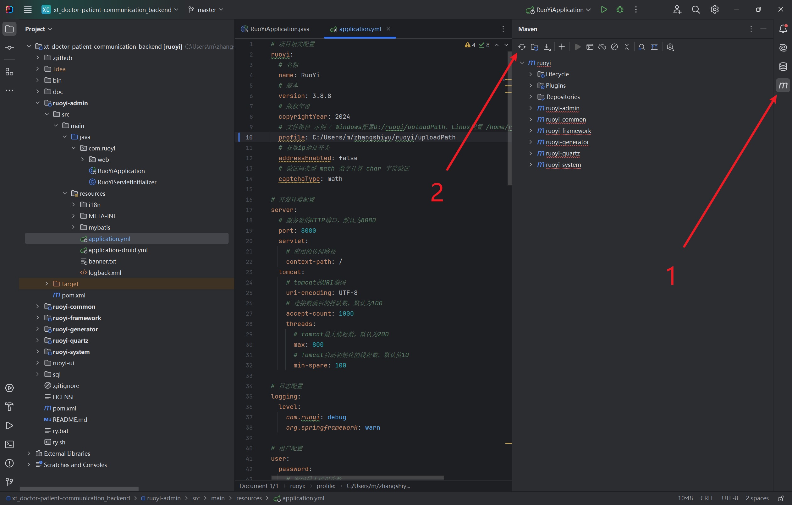

# 后端集成项目初始化
## 下载ruoyi-vue
https://gitee.com/y_project/RuoYi-Vue.git

## maven初始化

## 代码初始化
修改`profile`路径
```yml
# application.yml
# 项目相关配置
ruoyi:
  # 名称
  name: RuoYi
  # 版本
  version: 3.8.8
  # 版权年份
  copyrightYear: 2024
  # 文件路径 示例（ Windows配置D:/ruoyi/uploadPath，Linux配置 /home/ruoyi/uploadPath）
  profile: C:/Users/m/zhangshiyu/ruoyi/uploadPath
  # 获取ip地址开关
  addressEnabled: false
  # 验证码类型 math 数字计算 char 字符验证
  captchaType: math
```
```yml
# application-druid.yml
# 数据源配置
spring:
  datasource:
    type: com.alibaba.druid.pool.DruidDataSource
    driverClassName: com.mysql.cj.jdbc.Driver
    druid:
      # 主库数据源
      master:
        url: jdbc:mysql://localhost:3306/ry-vue?useUnicode=true&characterEncoding=utf8&zeroDateTimeBehavior=convertToNull&useSSL=true&serverTimezone=GMT%2B8
        username: root
        password: password
```
