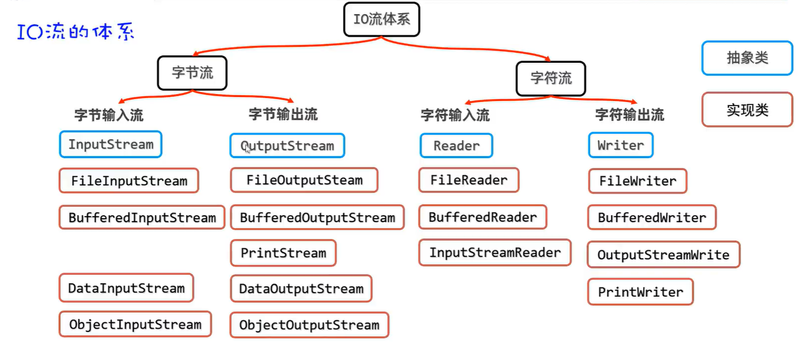
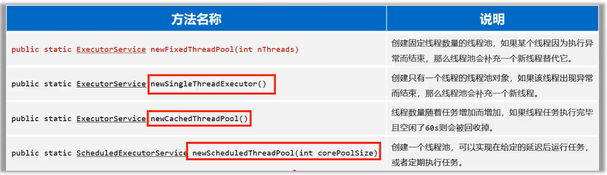
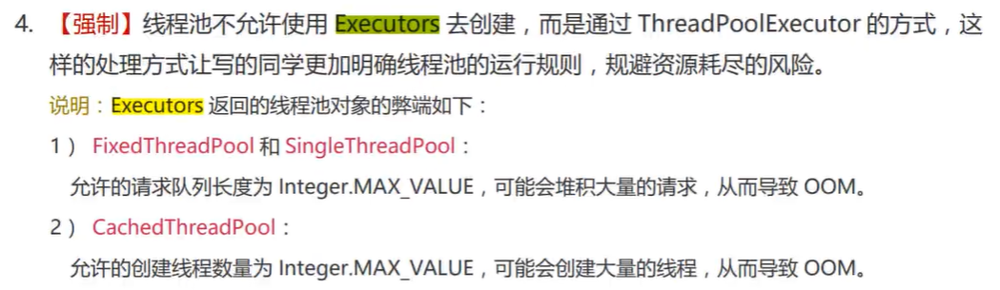
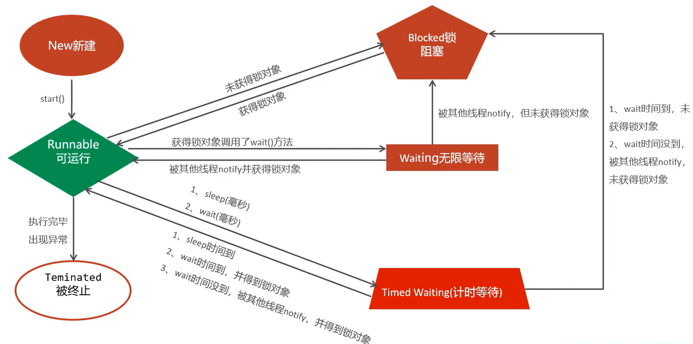

# java

## 名词介绍
- Java SE(Java Standard Edition)
- Java EE(Java Enterprise Edition)
- JDK(Java Development Kit)
- JRE(Java Runtime Environment)
- JVM(Java Virtual Machine)

## 下载
[下载地址(openjdk)](https://www.openlogic.com/openjdk-downloads)

## 配置环境变量
> TODO: 单独开一个模块写这块内容

## 终端测试是否安装成功
输入以下命令，如果有输出，则表示安装完成
```sh
# 执行
java
# 编译
javac
```

## hello world
开发`java`程序，需要三个步骤：编写、编译、运行

具体步骤：
1. 编写`HelloWorld.java`
```java
// HelloWorld.java
public class HelloWorld {
    public static void main(String[] args) {
        System.out.println("hello world");
    }
}
```
2. 通过`javac`编译`HelloWorld.java`生成`HelloWorld.class`
```sh
javac HelloWorld.java
```
3. 通过`java`执行`HelloWorld.class`
```sh
java HelloWorld
# output
hello world
```

## Idea开发步骤
new Project -> new Module -> new Package -> new Class

## Idea Snippets
- main/psvm
```java
public static void main(String[] args) {

}
```
- sout
```java
System.out.println();
```

## 声明变量
```java
int age = 18;
```

## 基础类型
> TODO: 把图转换为代码


| 数据类型 | 数据类型 | 字节数 | 数据范围   | 声明                  |
| -------- | -------- | ------ | ---------- | --------------------- |
| 整型     | byte     | 1      | -2^8~2^8-1 | `byte sex = 1;`       |
| 整型     | short    | 2      |            | `short foo = 1;`      |
| 整型     | int      | 4      |             | `int foo = 1;`        |
| 整型     | long     | 8      |            | `long foo = 1L;`      |
| 浮点型   | float    | 4      |            | `float foo = 1.1F;`   |
| 浮点型   | double   | 8      |            | `double foo = 1.1;`   |
| 字符型   | char     | 2      | 0~2^8      | `char foo = '1';`     |
| 布尔型   | boolean  | 1      |            | `boolean foo = true;` |

## 类型转换
### 自动类型转换
描述：范围小的类型可以赋值给范围类型大的类型

`byte` -> `short` -> `int` -> `long` -> `float` -> `double`

`char` -> `int` -> `long` -> `float` -> `double`

```java
byte foo = 1;
int bar = foo;
// output: 1
System.out.println(foo);
// output: 1
System.out.println(bar);
```

转换原理：`foo 00000001` ->`bar 00000000 00000000 00000000 00000001`

### 表达式的自动类型转换
描述：在表达式中，范围小的变量会转换为范围最大的变量类型参与运算。

`byte`、`short`、`char` -> `int` -> `long` -> `float` -> `double`

:::tip
`byte`、`short`、`char`是直接转换为`int`类型参与运算
:::

```java
int foo = 1;
long bar = 1L;
long baz = foo + bar;
// output: 2
System.out.println(baz);
```

### 强制类型转换
描述：强制把范围大的变量转换为范围小的变量

:::tip
- 可能出现数据丢失
- 浮点型转换为整型只保留整数
:::

```java
int foo = 1;
byte age = (byte) foo;
```
转换原理：`foo 00000000 00000000 00000000 00000001` ->`bar 00000001`

## 运算符
| 符号 | 作用           |
| ---- | -------------- |
| +    | 加             |
| -    | 减             |
| *    | 乘             |
| /    | 除，结果取整数 |
| %    | 取余数         |
| ++   | 自增           |
| --   | 自减           |

:::tip
`+`: 如果是两个数字相加，采用数学运算。如果含字符串，则是字符串拼接
:::

## 案例：获取用户的终端输入
```java
import java.util.Scanner;

public class Main {
    public static void main(String[] args) {
        Scanner scanner = new Scanner(System.in);

        System.out.println("Please input your name:");
        String name = scanner.nextLine();
        System.out.println("Please input your age:");
        int age = scanner.nextInt();
        System.out.println("Your name is " + name + ", age is " + age);
    }
}
```

## 案例：猜数字
```java
import java.util.Random;
import java.util.Scanner;

public class Main {
    public static void main(String[] args) {
        Random random = new Random();
        int num = random.nextInt(100);
        Scanner scanner = new Scanner(System.in);
        while (true) {
            System.out.println("Please input num:");
            int input = scanner.nextInt();
            if (input > num) {
                System.out.println("bigger");
            } else if (input < num) {
                System.out.println("litter");
            } else if (input == num) {
                System.out.println("correct");
                break;
            }
        }

    }
}
```

## 数组
```java
// 声明
int[] nums = { 1, 2, 3 };
// 动态初始化
// 默认值，整型为：0；浮点型为：0.0；boolean型：false；
int[] nums2 = new int[3];
// 修改
nums[0] = 0;
// 访问
System.out.println(nums[0]);
// 访问长度
System.out.println(nums.length);
```

::: tip
在`Java`中，使用数组需要注意越界问题
:::

## 方法
```java
public class Main {
    public static void main(String[] args) {
        // output: 3
        System.out.println(sum(1, 2));
    }
    public static int sum(int a, int b) {
        return a + b;
    }
}
```

## 方法重载
描述：一个类中，方法名重复，参数不一样
```java
public class Main {
    public static void main(String[] args) {
        // output: 6
        System.out.println(sum(1, 2, 3));
    }
    public static int sum(int a, int b) {
        return a + b;
    }
    public static int sum(int a, int b, int c) {
        return a + b + c;
    }
}
```

## 面向对象
::: code-group
```java [Main.java]
public class Main {
    public static void main(String[] args) {
        Student student = new Student();
        student.name = "tom";
        // output: tom
        System.out.println(student.name);
    }
}
```
```java [Student.java]
public class Student {
    String name;
}
```
:::

## This
描述：`this`指向当前对象
::: code-group
```java [Main.java]
public class Main {
    public static void main(String[] args) {
        Student student = new Student();
        student.printThis();
    }
}
```
```java [Student.java]
public class Student {
    public void printThis() {
        // output: com.mcg.Student@7d4991ad
        System.out.println(this);
    }
}
```
:::

## 构造器
::: code-group
```java [Main.java]
public class Main {
    public static void main(String[] args) {
        Student tom = new Student("tom");
        Student jerry = new Student("jerry", 2);
        // output: tom
        System.out.println(tom.name);
        // output: 2
        System.out.println(jerry.age);
    }
}
```
```java [Student.java]
public class Student {
    String name;
    int age;

    public Student(String name) {
        this.name = name;
    }
    public Student(String name, int age) {
        this.name = name;
        this.age = age;
    }
}
```
:::

::: tip
如果没有声明构造器，`Java`会自动生成一个无参构造器
:::

## 实体类
描述：成员变量必须私有，暴露相应的`get`和`set`方法，需要有个无参构造器
```java
public class Student {
    private String name;

    public String getName() {
        return name;
    }
    public void setName(String name) {
        this.name = name;
    }
}
```

## 包
描述：类似文件夹，用来管理不同程序的
```java
package com.mcg.javabean;

public class Student {
}
```

::: tip
- 同一个包下，无需导入
- 不同包，需要导入。需要手动引入`import 包名.类名`
- `Java.lang`无需导入
:::

## String
```java
public class Main {
    public static void main(String[] args) {
        String str = "foo";
        str += "bar";
        // output: foobar
        System.out.println(str);

        String foo = "foo";
        String foo2 = "foo";
        // output: true
        System.out.println(foo == foo2);

        String bar = new String("bar");
        String bar2 = new String("bar");
        // output: false
        System.out.println(bar == bar2);
    }
}
```

:::tip
- `String`对象时不可变的，每次赋值是生成一个新的对象并改变变量指向
- 以`"`声明的字符串会存在常量池中
- 以`new String`声明的字符串会放在堆内存中
:::

## ArrayList
描述：集合

::: tip
数组长度固定，集合的长度是动态的
:::

## static
描述：静态，修饰变量和方法。可通过类访问。

## 代码块
描述：静态代码块会在类加载时执行，实例代码块会在创建实例时在构造器前进行。

::: code-group
```java [Main.java]
public class Main {
    public static void main(String[] args) {
        System.out.println(Student.description);
        new Student();
    }
}
```
```java [Student.java]
public class Student {
    public static String description = "student";
    static {
        System.out.println("static");
    }
    {
        System.out.println("instance");
    }
}
```
```sh [Terminal]
static
student
instance
```
:::

## 单例模式
描述：确保一个类只有一个对象

步骤：
1. 私有构造器
2. 定义静态属性为类实例
3. 定义静态方法返回该实例

::: code-group
```java [饿汉式]
// 饿汉式单例：在获取实例前，提前创建好实例
public class A {
    private static final A a = new A();
    private A() {};
    public static A getObject() {
        return a;
    }
}
```
```java [懒汉式]
// 懒汉式单例：在获取实例时，才创建实例
public class A {
    private static A a;
    private A() {};
    public static A getObject() {
        if (a == null) {
            a = new A();
        }
        return a;
    }
}
```
:::

## 继承
描述：用`extends`关键字实现继承

特点
- 子类能继承父类的非私有的成员
- 实例的创建是由子类和父类共同完成的
- 不支持多继承
- 所有类都继承`Object`类

::: code-group
```java [Main.java]
public class Main {
    public static void main(String[] args) {
        Child child = new Child();
        // error: 'name' has private access in 'com.mcg.javabean.Parent'
        // System.out.println(child.name);
        // output: true
        System.out.println(child.childFlag);
        // output: true
        System.out.println(child.humanFlag);
    }
}
```
```java [Parent.java]
public class Parent {
    public boolean humanFlag = true;
    private String name = "tom";
}
```
```java [Child.java]
public class Child extends Parent {
    public boolean childFlag = true;
}
```
:::

## 权限修饰符
描述：限制类成员的访问范围

| 修饰符  | 本类 | 同一个包 | 子包 | 任意包 |
| ------- | ---- | -------- | ---- | ------ |
| private | ✔️    | ❌        | ❌    | ❌      |
| default | ✔️    | ✔️        | ❌    | ❌      |
| protect | ✔️    | ✔️        | ✔️    | ❌      |
| public  | ✔️    | ✔️        | ✔️    | ✔️      |

## 方法重写
描述：子类继承父类时，重写父类的方法

:::tip
- 使用`@Override`注解（推荐）
- 子类的方法访问权限必须大于父类的
- 子类的返回值需要收敛
:::

::: code-group
```java [Main.java]
public class Main {
    public static void main(String[] args) {
        Child child = new Child();
        // output: hello
        child.say();
    }
}
```
```java [Parent.java]
public class Parent {
    public void say() {
        System.out.println("hi");
    }
}
```
```java [Child.java]
public class Child extends Parent {
    @Override
    public void say() {
        System.out.println("hello");
    }
}
```
:::

## 访问成员
描述：采用就近原则。通过`this`访问实例成员。通过`super`访问父类成员。

::: code-group
```java [Main.java]
public class Main {
    public static void main(String[] args) {
        Child child = new Child();
        child.say();
    }
}
```
```java [Parent.java]
public class Parent {
    public String name = "tom";
}
```
```java [Child.java]
public class Child extends Parent {
    public String name = "jerry";
    public void say() {
        String name = "bob";
        // output: bob
        System.out.println(name);
        // output: jerry
        System.out.println(this.name);
        // output: tom
        System.out.println(super.name);
    }
}
```
:::

## 子类构造器
描述：父类构造器会在子类构造器之前执行完

:::tip
- 子类构造器的第一行如果没写`super()`，`Java`会默认添加`super()`
- 通过`this()`调用兄弟构造器
- `super()`和`this()`只能出现在第一行
:::

::: code-group
```java [Main.java]
public class Main {
    public static void main(String[] args) {
        Child child = new Child();
    }
}
```
```java [Parent.java]
public class Parent {
    public boolean isHuman;
    public Parent() {
        System.out.println("parent init");
        this.isHuman = true;
    }
}
```
```java [Child.java]
public class Child extends Parent {
    public String name;
    public Child() {
        this("jerry");
    }
    public Child(String name) {
        super();
        System.out.println("child init");
        this.name = name;
    }
}
```
```sh [Terminal]
parent init
child init
```
:::

## 多态
描述：多态是继承后的一种的现象，需要存在方法重写

语法
```java
父类 instance = new 子类()
```

:::tip
- 多态是是指对象、行为的多态
- 多态下不能使用子类的独有功能，可以通过强制类型转换解决
:::

::: code-group
```java [Main.java]
public class Main {
    public static void main(String[] args) {
        Animal cat = new Cat();
        // output: meow
        cat.speak();
        // error: Cannot resolve method 'scratch' in 'Animal'
        // cat.scratch();
        // 强转前最好类型校验一下
        if (cat instanceof Cat) {
            Cat theCat = (Cat)cat;
            theCat.scratch();
        }
        Animal dog = new Dog();
        // output: wow
        dog.speak();
    }
}
```
```java [Animal.java]
public class Animal {
    public void speak() {
        System.out.println("o");
    }
}
```
```java [Cat.java]
public class Cat extends Animal {
    @Override
    public void speak() {
        System.out.println("meow");
    }
    public void scratch() {}
}
```
```java [Dog.java]
public class Dog extends Animal {
    @Override
    public void speak() {
        System.out.println("wow");
    }
}
```
:::

## final
描述：修饰符

特性：
- 修饰类时，该类无法继承
- 修饰方法，该方法无法重写
- 修饰变量，该变量只能赋值一次

## abstract
描述：修饰符

特性：
- 抽象类可以有抽象方法，抽象方法所在的类一定是抽象类
- 修饰方法时，只能有抽象签名，不能有方法体，交给子类实现
- 抽象类不能创建对象

## interface
描述：接口

特性：
- 接口不能创建对象，需要通过类`implements`，此类称为实现类
- 接口方法只能有抽象签名，不能有方法体
- 类可以实现多个接口

新特性：
- `default`修饰方法时，需要写方法体，默认加上`public`修饰
- `private`修饰方法时，需要写方法体，为私有方法，`JDK9`支持
- `static`修饰方法时，需要写方法体，为静态方法，默认加上`public`修饰

方法签名冲突问题：
- 类实现多个接口，不支持实现。可通过类重写解决。
- 类继承父类实现接口，父类优先

## 内部类

### 成员内部类
::: code-group
```java [Main.java]
public class Main {
    public static void main(String[] args) {
        Animal.Cat cat = new Animal().new Cat();
    }
}
```
```java [Animal.java]
public class Animal {
    private String symbol = "animal";
    public class Cat {
        private String symbol = "cat";
        // JDK16 才支持
        // private static String description  = "cute";
        public void print() {
            System.out.println(this.symbol);
            System.out.println(Animal.this.symbol);
        }
    }
}
```
:::

### 静态内部类
::: code-group
```java [Main.java]
public class Main {
    public static void main(String[] args) {
        Animal.Cat cat = new Animal().new Cat();
    }
}
```
```java [Animal.java]
public class Animal {
    private String symbol = "animal";
    public static class Cat {
        private String symbol = "cat";
        public void print() {
            System.out.println(this.symbol);
            // error: 'com.mcg.javabean.Animal.this' cannot be referenced from a static context
            // System.out.println(Animal.this.symbol);
        }
    }
}
```
:::

### 局部内部类
描述：定义在方法、代码块、构造器等里面的类

### 匿名内部类
描述：不需要命名的局部内部类

::: code-group
```java [Main.java]
public class Main {
    public static void main(String[] args) {
        Animal cat = new Animal() {
            @Override
            public void speak() {
                System.out.println("meow");
            }
        };
        // output: meow
        cat.speak();
    }
}
```
```java [Animal.java]
public class Animal {
    public void speak() {
        System.out.println("o");
    }
}
```
:::

## 枚举

::: code-group
```java [Main.java]
public class Main {
    public static void main(String[] args) {
        // output: Male
        System.out.println(Sex.Male);
    }
}

```
```java [Sex.java]
public enum Sex {
    Male,
    Female
}
```
```java [Sex.class]
Compiled from "Sex.java"
public final class com.mcg.Sex extends java.lang.Enum<com.mcg.Sex> {
  public static final com.mcg.Sex Male;
  public static final com.mcg.Sex Female;
  public static com.mcg.Sex[] values();
  public static com.mcg.Sex valueOf(java.lang.String);
  static {};
}
```
:::

## 泛型
描述：定义类、接口、方法时，声明的类型变量

:::tip
不支持基础类型，只支持对象类型
:::

### 泛型类
::: code-group
```java [Main.java]
public class Main {
    public static void main(String[] args) {
        Store<Integer> store = new Store<>(1);
        Integer value = store.getValue();
    }
}
```
```java [Store.java]
public class Store <E> {
    private E value;
    public Store(E value) {
        this.value = value;
    }
    public E getValue() {
        return value;
    }
}
```
:::

### 泛型方法
```java
public class Main {
    public static void main(String[] args) {
        Integer value = getValue(1);
    }
    public static <T> T getValue(T value) {
        return value;
    }
}
```

### 通配符
特点：
- `?`是通配符，代表一切类型符合条件
- `? extends Animal`，当前类和子类符合条件
- `? super Animal`，当前类和父类符合条件

```java
public class Main {
    public static void main(String[] args) {
        List list = getList(new ArrayList<Cat>());
    }
    public static List getList(ArrayList<? extends Animal> list) {
        return list;
    }
}
```

## 自动装箱和自动拆箱
```java
public class Main {
    public static void main(String[] args) {
        // 自动装箱
        Integer i = 1;
        // 自动拆箱
        int i2 = i;
    }
}
```

## Lambda
描述：简化匿名内部类的方法，被`@FunctionalInterface`修饰的接口、类才可以被简化

```java
public class Main {
    public static void main(String[] args) {
        ArrayList<Integer> numList = new ArrayList<>();
        numList.add(1);
        numList.add(3);
        numList.add(2);
        // numList.sort(new Comparator<Integer>() {
        //     @Override
        //     public int compare(Integer o1, Integer o2) {
        //         return Integer.compare(o1, o2);
        //     }
        // });
        numList.sort((o1, o2) -> Integer.compare(o1, o2));
        // output:[1，2, 3]
        System.out.println(numList);
    }
}
```

## 方法引用
描述：进一步简化`Lambda`表达式

### 静态类型方法引用
```java
public class Main {
    public static void main(String[] args) {
        ArrayList<Integer> numList = new ArrayList<>();
        numList.add(1);
        numList.add(3);
        numList.add(2);
        // numList.sort((o1, o2) -> Integer.compare(o1, o2));
        numList.sort(Integer::compare);
        System.out.println(numList);
    }
}
```

### 特定类型方法引用
```java
public class Main {
    public static void main(String[] args) {
        ArrayList<Integer> numList = new ArrayList<>();
        numList.add(1);
        numList.add(3);
        numList.add(2);
        // numList.sort((o1, o2) -> o1.compareTo(o2));
        numList.sort(Integer::compareTo);
        System.out.println(numList);
    }
}
```

### 构造器引用
:::code-group
```java [Main.java]
public class Main {
    public static void main(String[] args) {
        // MyArrayListCreator<Integer> myArrayListCreator = new MyArrayListCreator<Integer>() {
        //     @Override
        //     public ArrayList<Integer> create() {
        //         return new ArrayList<>();
        //     }
        // };
        // MyArrayListCreator<Integer> myArrayListCreator = () -> new ArrayList<>();
        MyArrayListCreator<Integer> myArrayListCreator = ArrayList::new;
    }
}
```
```java [MyArrayListCreator.java]
public interface MyArrayListCreator<T> {
    ArrayList<T> create();
}
```
:::

## 异常
描述：异常在`Java.lang.Throwable`包下。分为`Error`和`Exception`，`Error`是系统级别的错误，开发者不用管。`Exception`分为运行时异常`RuntimeException`和编译时异常。

### 运行时异常
:::code-group
```java [Main.java]
public class Main {
    public static void main(String[] args) {
        // Exception in thread "main" com.mcg.IllegalNumRuntimeError: num 11 is illegal
        //     at com.mcg.Main.handleNum(Main.java:15)
        //     at com.mcg.Main.main(Main.java:10)
        handleNum(11);
    }
    public static void handleNum(int num) {
        if (num > 10) {
            throw new IllegalNumRuntimeError("num " + num + " is illegal");
        }
    }
}
```
```java [IllegalNumRuntimeError.java]
class IllegalNumRuntimeError extends RuntimeException {
    public IllegalNumRuntimeError(String message) {
        super(message);
    }
}
```
:::

### 编译时异常
:::code-group
```java [Main.java]
public class Main {
    public static void main(String[] args) throws IllegalNumRuntimeError {
        try {
            handleNum(111);
        } catch (IllegalNumRuntimeError e) {
            throw e;
        }
    }
    public static void handleNum(int num) throws IllegalNumRuntimeError {
        if (num > 10) {
            throw new IllegalNumRuntimeError("num " + num + " is illegal");
        }
    }
}
```
```java [IllegalNumRuntimeError.java]
class IllegalNumRuntimeError extends Exception {
    public IllegalNumRuntimeError(String message) {
        super(message);
    }
}
```
:::

## 集合
集合分为`Collection`和`Map`
- `Collection`每个元素是一个值
- `Map`每个元素是键值对

## Stream
描述: 用于操作集合或数组

```java
ArrayList<String> nameList = new ArrayList<>();
nameList.add("哈吉咪");
nameList.add("曼布");
nameList.add("曼波");
nameList.add("哈吉喵");
List<String> haNameList = nameList
        .stream()
        .filter(name -> name.contains("哈"))
        .collect(Collectors.toList());
// output: [哈吉咪, 哈吉喵]
System.out.println(haNameList);
```

## IO

```java
// 读取文件或文件夹
File file = new File("C:\\index.html");
// output: 132
System.out.println(file.length());
```

## 字符、字节、位
描述：字符根据编码规则有多个字节，一个字节有8位，一位用0或1表示

## 编码解码
```java
// encode
byte[] bytes = "hello".getBytes();
// [104, 101, 108, 108, 111]
System.out.println(Arrays.toString(bytes));
// decode
String string = new String(bytes);
// output: hello
System.out.println(string);
```

## 字节流和字符流
描述: 字节流适用于读写字节，字符流适用于读写字符
> - 字节流`FileInputStream`、`FileOutputStream`
> - 字符流`FileReader`、`FileWriter`

### 字节流
```java
// 使用try-resource回收实现Closeable接口的类。调用close()方法
try (
    InputStream is = new FileInputStream("C:\\Users\\m\\zhangshiyu\\workspace\\learn_java8\\hajimi\\src\\main\\java\\com\\mcg\\index.html");
    OutputStream os = new FileOutputStream("C:\\Users\\m\\zhangshiyu\\workspace\\learn_java8\\hajimi\\src\\main\\java\\com\\mcg\\index2.html");
) {
    int kb = 2 ^ 10;
    byte[] buffer = new byte[kb];
    int len;
    while ((len = is.read(buffer)) != -1) {
        os.write(buffer, 0, len);
    }
}
```

### buffer
描述: `BufferFileInputStream`包装`FileInputStream`，会在内存中开辟一个`8kb`的内存空间来充当程序和文件的媒介，提高读写效率

> - 如果手动用`byte[]`实现`buffer`的逻辑，则时间接近。
> - 如果缓存的大小越大速度越快，但是带来的速度提升越来越小。

```java
public class Main {
    final static String sourceFile = "C:\\Users\\m\\zhangshiyu\\temp\\PotPlayerSetup64.exe";
    final static String destPath = "C:\\Users\\m\\zhangshiyu\\temp";
    public static void main(String[] args) {
        // output: 单字节拷贝共耗时82415毫秒
        copy01();
        // output: 字节数组共耗时120毫秒
        copy02();
        // output: buffer单字节拷贝共耗时766毫秒
        copy03();
        // output: buffer字节数组共耗时33毫秒
        copy04();
    }
    private static void copy01() {
        try (
            FileInputStream is = new FileInputStream(sourceFile);
            FileOutputStream os = new FileOutputStream(destPath + "\\" + "01.exe");
        ) {
            long startMillis = System.currentTimeMillis();
            int b;
            while ((b = is.read()) != -1) {
                os.write(b);
            }
            long costMillis =  System.currentTimeMillis() - startMillis;
            System.out.println("单字节拷贝共耗时" + costMillis + "毫秒");
        } catch (IOException e) {
            System.out.println("error");
        }
    }
    private static void copy02() {
        try (
            FileInputStream is = new FileInputStream(sourceFile);
            FileOutputStream os = new FileOutputStream(destPath + "\\" + "01.exe");
        ) {
            long startMillis = System.currentTimeMillis();
            byte[] buffer = new byte[1024];
            int len;
            while ((len = is.read(buffer)) != -1) {
                os.write(buffer, 0, len);
            }
            long costMillis =  System.currentTimeMillis() - startMillis;
            System.out.println("字节数组共耗时" + costMillis + "毫秒");
        } catch (IOException e) {
            System.out.println("error");
        }
    }
    private static void copy03() {
        try (
            FileInputStream is = new FileInputStream(sourceFile);
            FileOutputStream os = new FileOutputStream(destPath + "\\" + "01.exe");
            BufferedInputStream bis = new BufferedInputStream(is);
            BufferedOutputStream bos = new BufferedOutputStream(os);
        ) {
            long startMillis = System.currentTimeMillis();
            int b;
            while ((b = bis.read()) != -1) {
                bos.write(b);
            }
            long costMillis =  System.currentTimeMillis() - startMillis;
            System.out.println("buffer单字节拷贝共耗时" + costMillis + "毫秒");
        } catch (IOException e) {
            System.out.println("error");
        }
    }
    private static void copy04() {
        try (
            FileInputStream is = new FileInputStream(sourceFile);
            FileOutputStream os = new FileOutputStream(destPath + "\\" + "01.exe");
            BufferedInputStream bis = new BufferedInputStream(is);
            BufferedOutputStream bos = new BufferedOutputStream(os);
        ) {
            long startMillis = System.currentTimeMillis();
            byte[] buffer = new byte[1024];
            int len;
            while ((len = bis.read(buffer)) != -1) {
                bos.write(buffer, 0, len);
            }
            long costMillis =  System.currentTimeMillis() - startMillis;
            System.out.println("buffer字节数组共耗时" + costMillis + "毫秒");
        } catch (IOException e) {
            System.out.println("error");
        }
    }
}
```

### 编码问题
描述：如果代码文件的编码格式和读取文件的编码格式不一致会导致乱码。通过`InputStreamReader`指定编码格式解决此问题。

```java
public class Main {
    final static String sourceFile = "C:\\Users\\m\\zhangshiyu\\temp\\verse.txt";
    public static void main(String[] args) {
        read();
    }

    private static void read() {
        try (
            FileInputStream is = new FileInputStream(sourceFile);
            InputStreamReader isr = new InputStreamReader(is, "GBK");
            BufferedReader br = new BufferedReader(isr)
        ) {
            String lineVal = br.readLine();
            // output: 床前明月光
            System.out.println(lineVal);
        } catch (IOException e) {
            System.out.println("error");
        }
    }
}
```

### 打印流
描述：使用简单高效（`PrintWriter`、`PrintStream`）。
```java
public class Main {
    final static String destPath = "C:\\Users\\m\\zhangshiyu\\temp";
    public static void main(String[] args) {
        printWrite();
    }

    private static void printWrite() {
        try (
            PrintWriter pw = new PrintWriter(destPath + "\\" + "verse.txt");
        ) {
            pw.println("床前明月光");
        } catch (IOException e) {
            System.out.println("error");
        }
    }
}
```

### 输出重定向
描述：把输出值重定向到打印流中
```java
public class Main {
    final static String destPath = "C:\\Users\\m\\zhangshiyu\\temp";
    public static void main(String[] args) {
        printWrite();
    }

    private static void printWrite() {
        try (
            PrintStream ps = new PrintStream(destPath + "\\" + "verse.txt");
        ) {
            System.setOut(ps);
            System.out.println("床前明月光");
        } catch (IOException e) {
            System.out.println("error");
        }
    }
}
```

### 数据流
描述：允许读写数据的类型和值（`DataOutputStream`、`DataInputStream`）
```java
public class Main {
    final static String destPath = "C:\\Users\\m\\zhangshiyu\\temp\\temp.txt";
    public static void main(String[] args) {
        write();
        read();
    }
    private static void write() {
        try (
            DataOutputStream dos = new DataOutputStream(new FileOutputStream(destPath));
        ) {
            dos.writeInt(1);
            dos.writeDouble(1.1);
            dos.writeUTF("床前明月光");
        } catch (IOException e) {
            System.out.println("error");
        }
    }
    private static void read() {
        try (
            DataInputStream dis = new DataInputStream(new FileInputStream(destPath));
        ) {
            // 1
            System.out.println(dis.readInt());
            // 1.1
            System.out.println(dis.readDouble());
            // 床前明月光
            System.out.println(dis.readUTF());
        } catch (IOException e) {
            System.out.println("error");
        }
    }
}
```

### 对象流
描述：将对象序列化的流

> - 对象需要实现`Serializable`
> - 不想被序列化的字段可以用`transient`修饰

:::code-group
```java [Main.java]
public class Main {
    final static String destPath = "C:\\Users\\m\\zhangshiyu\\temp\\temp.txt";
    public static void main(String[] args) {
        write();
        read();
    }
    private static void write() {
        try (
            ObjectOutputStream oos = new ObjectOutputStream(new FileOutputStream(destPath));
        ) {
            User user = new User();
            user.setName("tom");
            user.setPassword("123456");
            oos.writeObject(user);
        } catch (IOException e) {
            System.out.println("error");
        }
    }
    private static void read() {
        try (
            ObjectInputStream ois = new ObjectInputStream(new FileInputStream(destPath));
        ) {
            User user = (User) ois.readObject();
            // output: tom
            System.out.println(user.getName());
            // output: null
            System.out.println(user.getPassword());
        } catch (Exception e) {
            System.out.println("error");
        }
    }
}
```
```java [User.java]
public class User implements Serializable {
    /**
     * 名称
     */
    private String name;
    /**
     * 密码
     */
    private transient String password;

    public String getPassword() {
        return password;
    }

    public void setPassword(String password) {
        this.password = password;
    }

    public String getName() {
        return name;
    }

    public void setName(String name) {
        this.name = name;
    }
}
```
:::

## property文件流
:::code-group
```java [Main.java]
public class Main {
    final static String destPath = "C:\\Users\\m\\zhangshiyu\\temp\\index.properties";
    public static void main(String[] args) {
        write(read());
    }
    private static void write(Properties p) {
        try (
            OutputStream os = new FileOutputStream(destPath);
        ) {
            p.setProperty("sex", "0");
            // [index.properties]
            // #
            // #Wed Sep 18 15:48:09 CST 2024
            // age=12
            // name=tom
            // sex=0
            p.store(os, "");
        } catch (IOException e) {
            e.printStackTrace();
        }
    }

    private static Properties read() {
        Properties p = new Properties();
        try (
            InputStream is = new FileInputStream(destPath);
        ) {
            p.load(is);
            // output: {age=12, name=tom}
            System.out.println(p);
            return p;
        } catch (Exception e) {
            e.printStackTrace();
            return p;
        }
    }
}
```
```properties [index.properties]
name=tom
age=12
```
:::

## Thread
描述：开启一个线程

### extends Thread
描述：可以实现线程，但是无法`extends`自己的的类
:::code-group
```java [MyThread.java]
public class MyThread extends Thread {
    @Override
    public void run() {
        for (int i = 0; i < 5; i++) {
            System.out.println("子线程" + i);
        }
    }
}

```
```java [Main.java]
public class Main {
    public static void main(String[] args) {
        MyThread myThread = new MyThread();
        myThread.start();
        for (int i = 0; i < 5; i++) {
            System.out.println("主线程" + i);
        }
    }
}

```
```sh
主线程0
子线程0
子线程1
子线程2
子线程3
子线程4
主线程1
主线程2
主线程3
主线程4
```
:::

### implements Runnable
描述：可以实现线程，可以`extends`自己的类
:::code-group
```java [MyThread.java]
public class MyThread implements Runnable {
    @Override
    public void run() {
        for (int i = 0; i < 5; i++) {
            System.out.println("子线程" + i);
        }
    }
}
```
```java [Main.java]
public class Main {
    public static void main(String[] args) {
        MyThread myThread = new MyThread();
        new Thread(myThread).start();
        for (int i = 0; i < 5; i++) {
            System.out.println("主线程" + i);
        }
    }
}
```
```sh
主线程0
主线程1
子线程0
子线程1
子线程2
主线程2
子线程3
子线程4
主线程3
主线程4
```
:::

### implements Runnable Lambda
描述：可以实现线程，可以`extends`自己的类，可以获取线程执行结果
```java
public class Main {
    public static void main(String[] args) {
        new Thread(() -> {
            for (int i = 0; i < 5; i++) {
                System.out.println("子线程" + i);
            }
        }).start();
        for (int i = 0; i < 5; i++) {
            System.out.println("主线程" + i);
        }
    }
}
```
### Callable & FutureTask
:::code-group
```java [MyCallable.java]
public class MyCallable<S> implements Callable<String> {
    int n;

    public MyCallable(int n) {
        this.n = n;
    }

    @Override
    public String call() throws Exception {
        int total = 0;
        for (int i = 0; i < this.n; i++) {
            total += i;
        }
        return "1-" + n + "的和为：" + total;
    }
}
```
```java [Main.java]
public class Main {
    public static void main(String[] args) throws ExecutionException, InterruptedException {
        MyCallable<String> myCallable = new MyCallable<>(10);
        FutureTask<String> stringFutureTask = new FutureTask<>(myCallable);
        Thread thread = new Thread(stringFutureTask);
        thread.start();

        MyCallable<String> myCallable2 = new MyCallable<>(100);
        FutureTask<String> stringFutureTask2 = new FutureTask<>(myCallable2);
        Thread thread2 = new Thread(stringFutureTask2);
        thread2.start();

        // 调用get时，主线程会阻塞，直到线程执行完毕
        String result = stringFutureTask.get();
        // 1-10的和为：45
        System.out.println(result);
        String result2 = stringFutureTask2.get();
        // 1-100的和为：4950
        System.out.println(result2);
    }
}
```
:::

### Thread api
:::code-group
```java [Main.java]
public class Main {
    public static void main(String[] args) throws ExecutionException, InterruptedException {
        MyThread myThread = new MyThread();
        myThread.setName("thread-1");
        // output: thread-1 is running
        myThread.start();
        myThread.join();
        MyThread myThread2 = new MyThread();
        myThread2.setName("thread-2");
        // output: thread-2 is running
        myThread2.start();
        myThread.join();
        Thread thread = Thread.currentThread();
        // output: main is running
        System.out.println(thread.getName() + " is running");
    }
}
```
```java [MyThread.java]
class MyThread extends Thread {
    @Override
    public void run() {
        try {
            Thread.sleep(1000);
        } catch (InterruptedException e) {
            throw new RuntimeException(e);
        }
        Thread thread = Thread.currentThread();
        System.out.println(thread.getName() + " is running");
    }
}
```
:::

## 线程安全
:::code-group
```java [Main.java]
public class Main {
    public static void main(String[] args) {
        Account account = new Account(10000);
        new DrawThread(account, "tom").start();
        new DrawThread(account, "jerry").start();
    }
}
```
```java [Account.java]
public class Account {
    private int money;

    public Account(int money) {
        this.money = money;
    }

    public void draw(int money) {
        String name = Thread.currentThread().getName();
        if (this.money >= money) {
            System.out.println(name + " withdraws " + money + " successfully");
            this.money -= money;
            System.out.println("The balance is " + this.money);
        } else {
            System.out.println(name + " withdraws " + money + " failed");
        }
    }
}
```
```java [DrawThread.java]
public class DrawThread extends Thread {
    private Account account;

    public DrawThread(Account account, String name) {
        super(name);
        this.account = account;
    }

    @Override
    public void run() {
        account.draw(10000);
    }
}
```
```sh [output]
tom withdraws 10000 successfully
The balance is 0
jerry withdraws 10000 successfully
The balance is -10000
```
:::
## `synchronized`代码块锁
描述：利用`synchronized`代码块，传入唯一对象作为锁，实现线程安全

> - 在实例方法中传入可以传入线程共享的资源作为唯一对象，如下面案例中的`this`，指向当前账户，可以避免其余账户业务被锁的
> - 在静态方法中传入可以传入`xxx.class`类字节码对象作为唯一对象

:::code-group
```java [Main.java]
public class Main {
    public static void main(String[] args) {
        Account account = new Account(10000);
        new DrawThread(account, "tom").start();
        new DrawThread(account, "jerry").start();
    }
}
```
```java{10} [Account.java]
public class Account {
    private int money;

    public Account(int money) {
        this.money = money;
    }

    public void draw(int money) {
        String name = Thread.currentThread().getName();
        synchronized (this) {
            if (this.money >= money) {
                System.out.println(name + " withdraws " + money + " successfully");
                this.money -= money;
                System.out.println("The balance is " + this.money);
            } else {
                System.out.println(name + " withdraws " + money + " failed");
            }
        }
    }
}
```
```java [DrawThread.java]
public class DrawThread extends Thread {
    private Account account;

    public DrawThread(Account account, String name) {
        super(name);
        this.account = account;
    }

    @Override
    public void run() {
        account.draw(10000);
    }
}
```
```sh [output]
tom withdraws 10000 successfully
The balance is 0
jerry withdraws 10000 failed
```
:::
## `synchronized`方法锁
描述：通过`synchronized`方法修饰符声明方法，和`synchronized`代码块锁功能一致，会在内部生成一个锁

> - 在实例方法中，锁为的`this`
> - 在静态方法中，锁为`xxx.class`类字节码对象

:::code-group
```java [Main.java]
public class Main {
    public static void main(String[] args) {
        Account account = new Account(10000);
        new DrawThread(account, "tom").start();
        new DrawThread(account, "jerry").start();
    }
}
```
```java{8} [Account.java]
public class Account {
    private int money;

    public Account(int money) {
        this.money = money;
    }

    public synchronized void draw(int money) {
        String name = Thread.currentThread().getName();
        if (this.money >= money) {
            System.out.println(name + " withdraws " + money + " successfully");
            this.money -= money;
            System.out.println("The balance is " + this.money);
        } else {
            System.out.println(name + " withdraws " + money + " failed");
        }
    }
}
```
```java [DrawThread.java]
public class DrawThread extends Thread {
    private Account account;

    public DrawThread(Account account, String name) {
        super(name);
        this.account = account;
    }

    @Override
    public void run() {
        account.draw(10000);
    }
}
```
```sh [output]
tom withdraws 10000 successfully
The balance is 0
jerry withdraws 10000 failed
```
:::
## `Lock`锁
描述：通过`ReentrantLock`实现

:::code-group
```java [Main.java]
public class Main {
    public static void main(String[] args) {
        Account account = new Account(10000);
        new DrawThread(account, "tom").start();
        new DrawThread(account, "jerry").start();
    }
}
```
```java{3,11,23} [Account.java]
public class Account {
    private int money;
    private final Lock lock = new ReentrantLock();

    public Account(int money) {
        this.money = money;
    }

    public void draw(int money) {
        try {
            lock.lock();
            String name = Thread.currentThread().getName();
            if (this.money >= money) {
                System.out.println(name + " withdraws " + money + " successfully");
                this.money -= money;
                System.out.println("The balance is " + this.money);
            } else {
                System.out.println(name + " withdraws " + money + " failed");
            }
        } catch (Exception e) {
            throw new RuntimeException(e);
        } finally {
            lock.unlock();
        }
    }
}

```
```java [DrawThread.java]
public class DrawThread extends Thread {
    private Account account;

    public DrawThread(Account account, String name) {
        super(name);
        this.account = account;
    }

    @Override
    public void run() {
        account.draw(10000);
    }
}
```
```sh [output]
tom withdraws 10000 successfully
The balance is 0
jerry withdraws 10000 failed
```
:::

## 线程通讯
描述：线程之间互相相互协调调用，避免资源争夺

:::code-group
```java [Main.java]
public class Main {
    public static void main(String[] args) {
        Desk desk = new Desk();

        new Thread(() -> {
            while (true) {
                desk.put();
            }
        }, "chef-1").start();
        new Thread(() -> {
            while (true) {
                desk.put();
            }
        }, "chef-2").start();
        new Thread(() -> {
            while (true) {
                desk.put();
            }
        }, "chef-3").start();

        new Thread(() -> {
            while (true) {
                desk.get();
            }
        }, "consumer-1").start();
        new Thread(() -> {
            while (true) {
                desk.get();
            }
        }, "consumer-2").start();
    }
}
```
```java [Desk.java]
public class Desk {
    private ArrayList<String> foodList = new ArrayList<>();

    public synchronized void put() {
        try {
            String name = Thread.currentThread().getName();
            if (foodList.isEmpty()) {
                String log = name + " make food";
                System.out.println(log);
                foodList.add(log);
                Thread.sleep(2000);
            }
            this.notifyAll();
            this.wait();
        } catch (InterruptedException e) {
            throw new RuntimeException(e);
        }
    }

    public synchronized void get() {
        try {
            String name = Thread.currentThread().getName();
            if (!foodList.isEmpty()) {
                String log = foodList.get(0) + ", then " + name + " eat food";
                System.out.println(log);
                foodList.clear();
                Thread.sleep(1000);
            }
            this.notifyAll();
            this.wait();
        } catch (InterruptedException e) {
            throw new RuntimeException(e);
        }
    }
}
```
```plain [output]
chef-1 make food
chef-1 make food, then consumer-1 eat food
chef-3 make food
chef-3 make food, then consumer-2 eat food
chef-2 make food
chef-2 make food, then consumer-1 eat food
chef-1 make food
chef-1 make food, then consumer-2 eat food
```
:::

## 线程池
:::tip
- 计算密集型应用，推荐核心数量为`核心数 + 1`
- `io`密集型应用，推荐核心数量为`核心数 * 2`
:::

:::code-group
```java [Main.java]
public class Main {
    public static void main(String[] args) {
        ThreadPoolExecutor threadPoolExecutor = new ThreadPoolExecutor(
                3,
                5,
                1000,
                TimeUnit.MILLISECONDS,
                new ArrayBlockingQueue<>(4),
                Executors.defaultThreadFactory(),
                new ThreadPoolExecutor.AbortPolicy()
        );

        MyRunnable myRunnable = new MyRunnable();
        // execute
        threadPoolExecutor.execute(myRunnable);
        threadPoolExecutor.execute(myRunnable);
        threadPoolExecutor.execute(myRunnable);

        // queue
        threadPoolExecutor.execute(myRunnable);
        threadPoolExecutor.execute(myRunnable);
        threadPoolExecutor.execute(myRunnable);
        threadPoolExecutor.execute(myRunnable);

        // open new temporary thread
        threadPoolExecutor.execute(myRunnable);
        threadPoolExecutor.execute(myRunnable);

        // error
        threadPoolExecutor.execute(myRunnable);
    }
}
```
```java [MyRunnable.java]
public class MyRunnable implements Runnable {
    @Override
    public void run() {
        String name = Thread.currentThread().getName();
        System.out.println("current thread name is " + name);
        try {
            Thread.sleep(1000);
        } catch (InterruptedException e) {
            throw new RuntimeException(e);
        }
    }
}
```
```plain [output]
current thread name is pool-1-thread-2
current thread name is pool-1-thread-3
current thread name is pool-1-thread-1
current thread name is pool-1-thread-4
current thread name is pool-1-thread-5
Exception in thread "main" java.util.concurrent.RejectedExecutionException: Task com.mcg.MyRunnable@14ae5a5 rejected from java.util.concurrent.ThreadPoolExecutor@7f31245a[Running, pool size = 5, active threads = 5, queued tasks = 4, completed tasks = 0]
    at java.util.concurrent.ThreadPoolExecutor$AbortPolicy.rejectedExecution(ThreadPoolExecutor.java:2063)
    at java.util.concurrent.ThreadPoolExecutor.reject(ThreadPoolExecutor.java:830)
    at java.util.concurrent.ThreadPoolExecutor.execute(ThreadPoolExecutor.java:1379)
    at com.mcg.Main.main(Main.java:34)
current thread name is pool-1-thread-3
current thread name is pool-1-thread-1
current thread name is pool-1-thread-4
current thread name is pool-1-thread-2
```
:::
## 线程池配合`Callable`使用
:::code-group
```java [Main.java]
public class Main {
    public static void main(String[] args) throws ExecutionException, InterruptedException {
        ThreadPoolExecutor threadPoolExecutor = new ThreadPoolExecutor(
                3,
                5,
                1000,
                TimeUnit.MILLISECONDS,
                new ArrayBlockingQueue<>(4),
                Executors.defaultThreadFactory(),
                new ThreadPoolExecutor.AbortPolicy()
        );

        Future<String> future1 = threadPoolExecutor.submit(new MyCallable(100));
        Future<String> future2 = threadPoolExecutor.submit(new MyCallable(200));
        Future<String> future3 = threadPoolExecutor.submit(new MyCallable(300));
        Future<String> future4 = threadPoolExecutor.submit(new MyCallable(400));

        System.out.println(future1.get());
        System.out.println(future2.get());
        System.out.println(future3.get());
        System.out.println(future4.get());
    }
}
```
```java [MyCallable.java]
public class MyCallable implements Callable<String> {
    int n;

    public MyCallable(int n) {
        this.n = n;
    }

    @Override
    public String call() throws Exception {
        String name = Thread.currentThread().getName();
        int total = 0;
        for (int i = 0; i < this.n; i++) {
            total += i;
        }
        return name + " --> 1-" + n + "的和为：" + total;
    }
}
```
```plain [output]
pool-1-thread-1 --> 1-100的和为：4950
pool-1-thread-2 --> 1-200的和为：19900
pool-1-thread-3 --> 1-300的和为：44850
pool-1-thread-1 --> 1-400的和为：79800
```
:::

## Executors
描述：创建线程池的工具类



:::warning

:::

## 并发 & 并行
描述：并发是`cpu`一瞬间执行多条线程，即快速处理完当前一些线程后又迅速处理其他线程；并行是`cpu`某一刻执行多条线程。

## 线程生命周期


## 悲观锁 & 乐观锁
描述：悲观锁就是默认的`synchronized`锁；乐观锁是指线程修改共享数据时，期望共享结果和实际读取结果不一致时，代表数据同时被另一个线程修改，当前线程则重新执行。乐观锁可以通过`AtomicInteger`等原子类实现。
:::code-group
```java [Main.java]
public class Main {
    public static void main(String[] args) {
        MyRunnable myRunnable = new MyRunnable();
        for (int i = 0; i < 100; i++) {
            new Thread(myRunnable).start();
        }
    }
}
```
```java [MyRunnable.java]
public class MyRunnable implements Runnable {
    private final AtomicInteger n = new AtomicInteger();

    @Override
    public void run() {
        for (int i = 0; i < 100; i++) {
            System.out.println("n: " + this.n.incrementAndGet());
        }
    }
}
```
:::

## 网络
:::code-group
```java [Main.java]
public class Main {
    public static void main(String[] args) throws UnknownHostException {
        InetAddress ip1 = InetAddress.getLocalHost();
        System.out.println(ip1.getHostName());
        System.out.println(ip1.getHostAddress());

        InetAddress ip2 = InetAddress.getByName("www.baidu.com");
        System.out.println(ip2.getHostName());
        System.out.println(ip2.getHostAddress());
    }
}
```
```plain [output]
LAPTOP-FQD1VNJF
192.168.56.87
www.baidu.com
36.155.132.76
```
:::

## UDP
:::code-group
```java [Server.java]
public class Server {
    public static void main(String[] args) throws SocketException {
        try (
                DatagramSocket datagramSocket = new DatagramSocket(3002)
        ) {
            byte[] buffer = new byte[64 * 2 ^ 10];
            DatagramPacket datagramPacket = new DatagramPacket(
                    buffer,
                    buffer.length,
                    InetAddress.getLocalHost(),
                    3001
            );
            datagramSocket.receive(datagramPacket);
            String str = new String(buffer, 0, datagramPacket.getLength());
            // output: hello
            System.out.println(str);
        } catch (IOException e) {
            throw new RuntimeException(e);
        }

    }
}
```
```java [Client.java]
public class Client {
    public static void main(String[] args) throws SocketException {
        try (
                DatagramSocket datagramSocket = new DatagramSocket(3001);
        ) {
            byte[] buffer = "hello".getBytes();
            DatagramPacket datagramPacket = new DatagramPacket(
                    buffer,
                    buffer.length,
                    InetAddress.getLocalHost(),
                    3002
            );
            datagramSocket.send(datagramPacket);
        } catch (IOException e) {
            throw new RuntimeException(e);
        }
    }
}
```
:::
